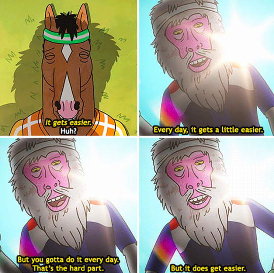

Los que vienen un rato siguiendo el blog saben que de vez en cuando me gusta escribirme cartas a mi que luego reviso; son mi forma de compartir con ustedes lo que está en mi cabeza y como planeo enfrentarlo. Espero que alguien que lea esto, le funcione y le ayude tanto como me ha ayudado a mí.

## 1. No se puede conectar los puntos mirando al futuro

Cuantas historias y momentos de nuestra vida nos sentimos completamente perdidos porque no sabemos que va a pasar a continuación. **Te aseguro que no es algo que solo te pasa a ti.** Así mismo hoy miras al pasado y esos momentos que parecía que todo iba a colapsar parecen como si tuvieron un propósito.

Si miras detenidamente podrás apreciar que las cosas que salieron de esa experiencia (mala o buena) debieron ser de esa forma para convertirte en quien eres. Así que si ahora mismo no puedes distinguir que tiene que ver lo que te pasa con algún "Propósito mayor" **sigue adelante, y lo verás.**

## 2. Exponte a situaciones que te hagan sentir incomodo

Mientras más nos expongamos a situaciones que nos hagan sentir incomodo, más nos abrimos a un mundo de posibilidades.

Creo que muchas cosas impuestas en nosotros desde pequeños por la sociedad, la religión, nuestros padres, nuestro entorno, han limitado nuestro verdadero potencial. **Dejamos de hacer cosas (incluso súper beneficiosas para nosotros) por esas limitaciones.** Intenta de vez en cuando ponerte en una situación donde tú mismo no creas que eres capaz de estar ni manejar, sigue hacia adelante y aprende de la experiencia. Puede que descubras algo interesante de ti oculto por mucho tiempo.

## 3. Empieza con el porqué

Lo escuché por primera vez hace años de la boca **Simon Sine**k en un video de esos que [YouTube](https://www.youtube.com/watch?v=u4ZoJKF_VuA) te recomienda y desde entonces es algo que pienso, pero muy pasivamente y creo que debería de darle algo más de protagonismo.

En vez de pensar que o como hacer, pregúntate por qué quieres hacerlo. Todos tienen un qué desean, y más del doble de las personas que conoces creen saber el cómo, pero ninguno sabe por qué. **Al levantarte o iniciar un nuevo proyecto, pregúntate por qué quieres hacerlo.** O aun mejor ¿Por qué sigues/quieres ese trabajo/relación? Es una pregunta que te ayudará a conocerte mejor y por supuesto, te mantendrá motivado más tiempo que las otras, _a partir de el porqué, busca el cómo y por último el qué vendrá solo._

## 4. El tiempo es un recurso no renovable

Esta es difícil de entender, porque a pesar de que **todos sabemos que esta vida es finita a veces sobrevaloramos nuestra propia mortalidad.** Los que han leído o escuchado de los [7 hábitos de las personas altamente efectivas](https://www.amazon.com/h%C3%A1bitos-gente-altamente-efectiva-Spanish/dp/6079377063/) les sonará el segundo habito que es: _Empieza con un fin en mente._

Al saber que un día cesar de existir nos dará un poco más de perspectiva y nos ayudará a manejar **el único recurso que es idéntico para todos los seres, las 24 horas de un día**. No voy a decirte que no veas la última temporada de Bojack Horseman por tercera vez de una sentada, solo que recuerdes que ese tiempo aunque consigas Los Millones de Chanflán (quien descubrí investigando para este post que no es _Chanflín_ como mi papá ha venido diciendo mi vida entera), nadie te lo va a devolver.

## 5. Aprende a visualizar no a fantasear

Pueden sonar similares, pero son diferentes. No vengo a decirte vainas holísticas de la fuerza del universo ni a hablar de [el Secreto](https://www.amazon.com/Rhonda-Byrne/dp/1582701962), todo esto es parte de tener una meta clara.

Si alguien te ha hablado de visualizar seguro confundiste con fantasear. Mientras que **visualizar incluye el trabajo necesario para alcanzar una meta**, fantasear se enfoca casi por completo en el momento de gloria con la mansión en The Hills. Asegúrate de no perder tiempo fantaseando sino, invertirlo en visualizar el resultado que deseas y como planeas obtenerlo.

> Dejemos de comprar mansiones en nuestras mentes con el dinero que vamos a ganar con la vaca que nos va a heredar nuestro padre cuando la becerra para.

## 6. Respira primero

<FloatedImage
  float="left"
  src="https://media.giphy.com/media/krP2NRkLqnKEg/giphy.gif"
  alt="Respira"
/>

Para descansar de esta lista vamos a tomar un respiro. Hazlo, es gratis. Adentro... Afuera... ¿Ves?, no fue tan difícil.

Ante las situaciones difícil nuestro cerebro primitivo desea pelear o huir. Y aunque _esto salvó a nuestros ancestros de ser aplastados por el meteorito que mandaron los mamuts para acabar con los dinosaurios_ (o algo así), los problemas de hoy tienen consecuencias menos fatales y menos inmediatas en la mayoría de los casos. Así que antes de tomar esa decisión dejándote guiar por tu mente primitiva cazadora de las cavernas, **respira al menos 10 segundos**. Y luego procede. No te imaginas la diferencia que hace eso.

## 7. Lo que se mide se controla

En inglés rima y todos sabemos que si rima es porque es verdad. Pero ya en toda seriedad, como sabemos que estamos haciendo algún avance si no sabemos de donde empezamos, como sabemos que nos hemos movido.

No tienes que crear un complejo sistema de poleas y palancas y registrar si te desayunas y qué, y luego estudiar si esto está relacionado con tu desempeño laboral (al menos que creas que sí, en cuyo caso: adelante). **Crea un registro de lo que has intentado y cómo para saber que repetir y que evitar en el futuro**.

Nuestras mentes no son de fiar ya que no tenemos el control real y absoluto de la información que ellas creen relevantes y deciden guardar y que no, pero un pedazo de papel, una libreta, un documento de Office, ahí si que no hay forma de que se pierda y podamos usar nuestro yo del pasado para ayudarnos hoy. Solo recuerda tener una copia de seguridad (esto aplica a los medios análogos también).

## 8. No tiene nada de mal no terminar algo

Lo único que es obligatorio terminar, como ya vimos antes, es la vida; fuera de eso, si ves que lo que estás haciendo no está resultando, si ya perdiste la pasión, si no hay forma de salvar la relación, si te sientes forzado en tu trabajo **nadie te obliga a auto-flagelarte y quedarte.**

Muévete, avanza, reinicia y alcanza. **Se necesita el doble de fuerza para dejar algo**, en especial si hay una relación emocional en el trasfondo, pero si recordamos que nuestro tiempo en esta tierra es finito, invertirlo de la forma correcta y en los proyectos correctos debe ser nuestra prioridad.

Por otro lado si NUNCA terminas nada, no vas a avanzar y es posible que tengas otra clase de problema. Por eso los consejos anteriores y este van muy de la mano. Siempre mide de donde vienes, a donde vas y él PORQUE estás iniciando o abandonando un proyecto y auto-evalúate.

## 9. La práctica deliberada es necesaria

Ya sea para romper o crear un hábito o aprender algo nuevo.

Si deseamos aprender a conducir y cada vez que nos montamos en el asiento del conductor encendemos y arrancamos y tocamos todos los botones, frenamos como locos, y aceleramos de golpe nunca vamos a aprender. Aísla las partes que componen lo que quieres hacer (o dejar de hacer) y enfócate en una o dos a la vez de forma deliberada.

Aprende primero el ritual de entrar al carro, ponerte el cinturón, encender, poner el cambio, quitar el freno antes de acelerar como loco cada vez. Créeme, una vez que domines esto no tendrás que _"sentir el vehículo un poco más lento que de costumbre para darte cuenta cuando te parqueas, luego de recorrer unos 5km que nunca quitaste el freno de mano"_ le pasó a un amigo, obviamente no a mi.

> Una vez que domines una de las partes, ir aprendiendo cada vez más se hará más fácil, pero debes hacerlo de forma consciente y deliberada, de lo contrario no habrá resultado.

## 10. Se hace más fácil cada día, pero debes hacerlo todos los días

Una de mis frases favoritas de Bojack, Horseman obviamente. Que también puede interpretarse como que **La consistencia es la clave del éxito.**

Si sales un día a correr y logras hacer 20 km ida y vuelta sin cansarte y luego no volver a caminar 200 metros en 100 días, felicidades pero no eres un atleta. Si quieres triunfar en algo, crecer como persona empresa, aprender a conducir o lo que sea, junto con practicar de forma deliberada y medir, debes ser consistente con lo que haces. Recuerda que cualquiera puede encestar un tiro de tres con los suficientes intentos, pero eso no te asegura un puesto en la NBA.

Dar resultados consistentes es lo que separa a los aficionados de los pros.

## Conclusión

Peco de no seguir mis propios consejos, sobre todo el último. La consistencia no es algo que se me dé naturalmente, pero es algo que intento mejorar deliberadamente, así que espero que puedan apreciar mi intento de mantener un post cada semana.

> La semana pasada no hubo post en el blog, pero si un nuevo episodio en el podcast que va tomando forma. Escúchalo [aquí](https://anchor.fm/releaseonfridays/episodes/Dejemos-los-memes-de-punto-y-coma-egchr6?utm_source=blog), es cortito.

Si esto te ha ayudado y/o crees que pueda ayudar a alguien más: **Compártelo**. Me gustaría saber cuál de estos tips o consejos ha sido el que más te ha impactado o gustado, o con el que estás teniendo más dificultad ahora mismo así que no dudes de escribirme por [Twitter](https://twitter.com/taverasmisael) (acepto DMs). Juntos podemos más. Espero saber de ti pronto. Ciao.

**NOTA** Ninguno de los enlaces son afiliados ni nada por el estilo.
