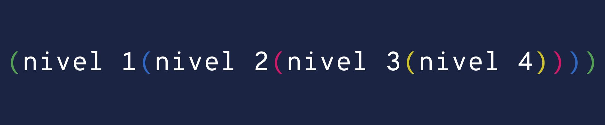

Desde su lanzamiento [Visual Studio Code][vscode] se convirtió en mi editor de texto favorito reemplazando a Sublime Text. El día de hoy, traigo una lista de 8 extensiones que he ido descubriendo en el camino y debo tener siempre conmigo ya sea porque me facilitan el desarrollo o simplemente agregan funcionalidades interesantes.

## 1. Settings Sync

Esta extensión es la mejor manera de tener toda la configuración sincronizada de modo que si tenemos que cambiar de computadora, formatear o sincronizar nuestro entorno en el trabajo con el personal no nos sea difícil.

Para usarla solo es necesario una cuenta en [github][github] y crear un token de acceso para que la extensión almacene como un [gist][githubgist] nuestra configuración. Al agregar el token a la configuración, nuestra configuración, extensiones instaladas y todo lo otro será almacenadas como un JSON en nuestra cuenta de Github. Cada vez que cambiemos algo o instalemos/desinstalemos alguna extensión Settings Sync lo mantendrá sincronizado. La mejor parte es que si queremos compartir nuestra configuración con alguien solo debemos darle el enlace (no el token) al gist y **podrán descargar, pero no subir nuestra configuración** y usarla.

[Ver en el marketplace][SettingsSync]

## 2. change-case

Para mi es sumamente común cambiar el nombre de las variables a que sean todas mayúsculas, o minúsculas, o usar solo la primera letra mayúsculas la demás minúsculas. Esto es algo que hago varias veces al día y que era sumamente tedioso hasta que encontré esta extensión.

Change case utiliza el [paquete de NPM][ChangeCaseNPM] con el mismo nombre para cambiar el texto en nuestro editor. Puede distinguir entre diferentes tipos de convenciones de nombre desde el `kebab-case` al `camelCase` `PascalCase` `lower_dash`. Todo esto desde la barra de comandos de VSCODE (CMD+SHIFT+P en Mac, CTRL+SHIFT+P en Windows y linux).

[Ver en el marketplace][ChangeCase]

## 3. IntelliCode

Una de las razones por la que VSCode tuvo tanta aceptación desde el inicio es porque venia cargado con el poderoso "motor" de [IntelliSense][IntelliSense] portado desde [Visual Studio][VisualStudio], el hermano mayor de code. IntelliSense es un conjunto de herramientas que incluyen autocompletado, asistencia de código y pistas o indicios de código sugiriendo opciones a la hora de escribir.

Ahora bien, IntelliCode es el bebé de IntelliSense, un poco de AI y machine learning disponible para Javascript, Typescript, Python y Java por ahora. Esto nos permite tener predicciones más precisas a la hora de escribir código ya que dependerá de nuestro entorno e irá aprendiendo de situaciones anteriores.

[Ver en el marketplace][IntelliCode]

## 4. Sort JSON Objects

Vamos a la mitad de la lista y no podía ponerse mas sencillo que esto. Una extensión para ordenar objetos JSON.

Al parecer VSCode no recuerda que un JSON es casi lo mismo que un objeto de JavaScript (con sus limitantes claro), y no sabe como ordenarlo alfabéticamente y ahí es cuando esta extensión entra en juego. Tan sencillo como instalar y usar en la próxima  vez que tengamos un JSON que debamos ordenar es solo seleccionar las líneasy con la barra de comando elegir `Ordenar JSON`. Listo

[Ver en el marketplace][SortJSON]

## 5. Jest

Todos nuestros proyectos tienen test, ¿cierto? Si no es así deberíamos, no es tan difícil y la recompensa es invaluable, ya en otro post explicaré porqué y cómo. En JavaScript a la hora de elegir con que deseamos hacer test tenemos muchas opciones, está: [Jest][JestIo], [Mocha][Mocha], [Ava][AVA], la lista sigue; pero yo siempre me voy por **Jest** ya que es mas sencillo tiene todo lo que necesito en un solo paquete.

Una vez que tenemos test en nuestra aplicación, debemos correrlos y esto implica ir a la terminal y ejecutar nuestro comando para probar y esperar que pasen o fallen. Esta extensión nos permite no abandonar nuestro editor cuando tengamos que ver si nuestro código funciona, ya que se integra perfectamente y en cada cambio corre los tests correspondientes y nos presenta un circulo verde al lado del nombre de la prueba si es correcto o resalta en rojo la línea que falla con el error a un lado. Incluso nos permite actualizar los snapshots desde el mismo editor si es lo que deseamos. Toda una joya.

[Ver en el marketplace][Jest]

## 6. GitLens

Por defecto la integración con los sistemas de versiones en Visual Studio Code es bastante buena (otra ventaja para mi al cambiarme de [ST][SublimeText]) pero aun así le faltan algunas cosas como: poder ver quien cambió la línea del código en la que estoy y cuando, ver el historial de cambios de cada archivo especifico, diferencia en los cambios.

Git lens agrega súper poderes a la experiencia con git dentro del editor haciendo comandos difíciles en la terminal y ausentes en VSCode sumamente sencillos y prácticos. Una vez que instalamos la extensión, esta nos dará un tour de configuración interactivo donde podemos elegir que tanto queremos usar de ella.

[Ver en el marketplace][GitLens]

## 7. ESLint & TSLint

Si trabajas con JavaScript y TypeScript estas dos extensiones son casi tan necesarias como el editor mismo.

### ESLint

Nos permite ver errores de estilo o de reglas en nuestro JavaScript utilizando el [paquete de NPM][EslintNPM] del mismo nombre. En el podemos configurar si deseamos usar comillas simples o comillas dobles, usar o ignorar punto y coma para finalizar las líneas, no permitir variables no definidas u obligar a definir siempre las variables antes de usarlas. Las combinaciones son infinitas y este plugin nos permite ver directamente en VSCode cuales de estas reglas nos están fallando como advertencias o errores.

[Ver en el marketplace][ESLint]

### TSLint

Si ESLint es para ECMAScript (JavaScript), TSLint es para TypeScript. Tiene las mismas opciones que ESLint pero adaptadas a Typescript con algunas nuevas reglas como forzar el uso de la letra `I` antes de las interfaces, especificar un orden en la declaración de miembros en una clase, y así por el estilo. Aunque esta extensión utiliza el [paquete de NPM][TSLintNPM] con el mismo nombre, estos han dicho que dejarán de darle soporte [para unirlo con ESLint][TSLintESLint] (en ingles) este mismo año (2019).

[Ver en el marketplace][TSLint]

## 8. Rainbow Brackets & indent-rainbow

Otro 2x1 para cerrar la lista de extensiones esenciales para VSCode. Estas dos extensiones a diferencia de las otras no aportan ninguna funcionalidad directa, que modifiquen el código, o que nos ayuden de una forma calculable, pero se ven bien, y nos ayudan a identificar los niveles de anidación del código.

### Rainbow Brackets

Es la extensión que nos permitirá ver cada par de paréntesis, corchetes, llave, de diferentes colores dependiendo de que anidado estén. Por defecto viene con 4 colores, pero podemos agregar mas en nuestro archivo de configuración de Visual Studio code.

[Ver en el marketplace][RainbowBrackets]

### indent-rainbow

Es parecido al anterior, pero este para la indentación nos ayuda a identificar que tan profundo esta nuestro código anidado dentro de otro de una forma visual agregando un ligero fondo que se va oscureciendo según el código se va anidando. Al igual que con Rainbow Brackets podemos agregar mas colores que no necesariamente se vayan oscureciendo y tener todo un arcoíris para identificar nuestro código.

[Ver en el marketplace][IndentRainbow]

## Conclusión

Esto termina nuestra lista de 8 extensiones que para mi son esenciales en VSCode, más dos extras. Si viste alguna extensión o si usas una que crees que debió estar en la lista déjame saber y así puedo agregarla a mi lista de esenciales. En otro post hablaré de mis temas e iconos favoritos, ando probando varios.

[vscode]: https://code.visualstudio.com
[github]: https://github.com
[githubgist]: https://gist.github.com
[SettingsSync]: https://marketplace.visualstudio.com/items?itemName=Shan.code-settings-sync
[ChangeCase]: https://marketplace.visualstudio.com/items?itemName=wmaurer.change-case
[ChangeCaseNPM]: https://npmjs.org/package/change-case
[IntelliCode]: https://marketplace.visualstudio.com/items?itemName=VisualStudioExptTeam.vscodeintellicode
[IntelliSense]: https://code.visualstudio.com/docs/editor/intellisense
[VisualStudio]: https://visualstudio.microsoft.com
[SortJSON]: https://marketplace.visualstudio.com/items?itemName=richie5um2.vscode-sort-json
[JestIo]: https://jestjs.io
[AVA]: https://github.com/avajs/ava
[Mocha]: https://mochajs.org/
[Jest]: https://marketplace.visualstudio.com/items?itemName=Orta.vscode-jest
[GitLens]: https://marketplace.visualstudio.com/items?itemName=eamodio.gitlens
[SublimeText]: https://www.sublimetext.com
[EslintNPM]: https://npmjs.org/package/eslint
[ESLint]: https://marketplace.visualstudio.com/items?itemName=dbaeumer.vscode-eslint
[TSLint]: https://marketplace.visualstudio.com/items?itemName=ms-vscode.vscode-typescript-tslint-plugin
[TSLintNPM]: https://npmjs.org/package/tslint
[TSLintESLint]: https://medium.com/palantir/tslint-in-2019-1a144c2317a9
[RainbowBrackets]: https://marketplace.visualstudio.com/items?itemName=2gua.rainbow-brackets
[IndentRainbow]: https://marketplace.visualstudio.com/items?itemName=2gua.rainbow-brackets
