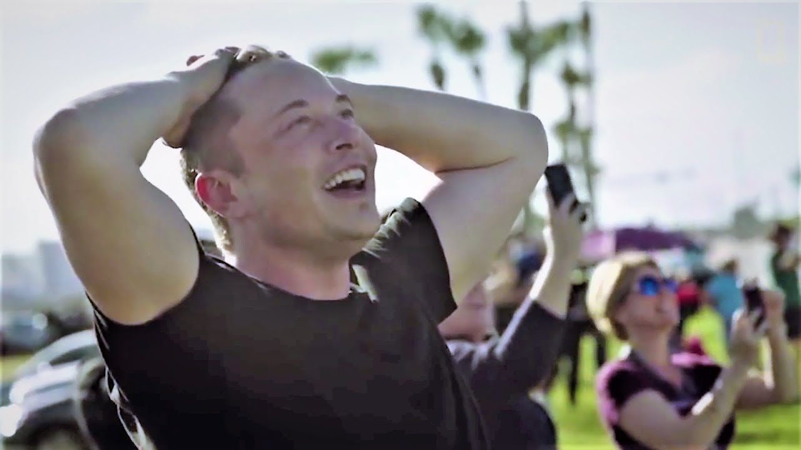

Hola, espero que el año haya iniciado bien para ti. Y si no fue del todo así, pues descuida, aún quedan días para mejorarlo.

Año tras años solemos ponernos metas, que seguimos y completamos mejorando como personas cada año. O puede que, como yo, nunca hayas completado **NINGUNA** de esas metas y sigues debiendo propósitos desde los tiempos de [Trilogy](https://en.wikipedia.org/wiki/Trilogy_(The_Weeknd_album)). Este año decidí tomarlo para cambiar eso, así que en lugar de agregar propósitos nuevos, revisé todos mis cuadernos y anotaciones, y busqué propósitos viejos que seguían siendo relevantes al día de hoy. _(Seamos honestos, tú y yo sabemos que mi oportunidad de ser astronauta pasó hace años)_.

Entre esos propósitos semi olvidados, me encontré con que quería hacer un Podcast. Desde bien joven mis profesores siempre me animaron a perseguir la carrera de locución y oratoria ¡Qué bien que no les hice caso, adoro lo que hago!

Desde que escuché el [primer episodio](https://spec.fm/podcasts/developer-tea/6527) de Developer Tea, el primer Podcast que escuché, he creído que es un medio interesante de comunicación. Es como la radio, pero `OnDemand` donde sí escuchas lo que te interesa, cuando te interesa. Han pasado los años y he consumido diferentes tipos de podcast: entrevistas, solo, multi presentadores, etc. Pero este año es de **dejar de consumir activamente, y producir.**

Crear el podcast supuso un reto para mí. Mi estudio no está preparado para sonidos (mucho con demasiado eco), no tenía ni siquiera micrófono, y mi experiencia con programas de audio es 0. Aún así, hice lo que siempre hago cuando algo me interesa, y me puse a [aprenderlo por mi cuenta](/blog/aprendiendo-a-aprender) y aunque sé que estoy lejos de ser perfecto, estoy más cerca de ser "bueno" que hace unos meses. Y ya tengo un micrófono, **so don't stop me now**.

## Un podcast sobre

Pues es algo que le he dado mucha mente: **¿De qué quiero hablar realmente?** Me han pasado todas las ideas locas por la cabeza, desde hablar de crecimiento personal, programación y cocina. Temas que no domino, excepto por el segundo, así que hace sentido hablar de eso.

Pero hablar de programación puede extenderse de diferentes maneras, de hecho aquí en el blog, hablo de programación, pero no es fácil de explicar ejemplos de código como si fuese un dictado.

> Sí, te hablo a ti profesor del politécnico que nos dictaba código y nos llevaba una vez al mes al laboratorio para al fin probar ese código esperando que si funcione. **Volviendo a nuestra programación habitual**...

Por otro lado, hay un punto de vista que solo he compartido hasta ahora con algunos de mis amigos más íntimos, que también son programadores. Este punto de vista es, **EL MIO**. Mis opiniones y experiencia que he adquirido a través de los años y que he compartido con algunos compañeros que viene a mí con dudas. En ocasiones el mismo día le respondía preguntas similares a dos y tres personas diferentes.

Lo que se me ocurre es hacer eso mismo, pero responderle a varias personas diferentes (*probablemente las mismas dos o tres*) pero hacerlo al mismo tiempo, a través del podcast.

Así que en resumen, el podcast sería yo compartiendo mis experiencias y opiniones de lo que he aprendido en mi camino, (que siento que apenas empieza), en el mundo del desarrollo, más por la parte web, tanto frontend como backend.

De vez en cuando, habrán invitados que serán entrevistados o co-presentadores dependiendo su naturaleza; pero ya veremos.

## Fecha de lanzamiento

El formato de lanzamiento del podcast va a ser semanal, pero **divido por temporadas**. Así que primero haré unos cuantos episodios juntos y los iré lanzando semanalmente. Para la semana del lanzamiento estoy pensando liberar al menos 4 episodios para que no tengas que esperar tanto por más contenido y a la vez yo poder tener feedback tuyo.

## Necesito tu ayuda

Bien, aunque sé cómo y qué quiero hacer ~~kindda~~  al final del día este contenido va a ser para ti, así que me gustaría saber tu opinión en algunas cosas. Para ello creé un pequeño formulario de Google con 4 preguntas sencilla de selección y significaría el mundo para mí si pudieras tomarte 30 segundos de tu tiempo y llenarlo. Entre las preguntas está una selección de algunos posibles nombres y me gustaría saber cual te gusta más.

[Aquí el link para el formulario que decidirá el futuro de tu país.](https://forms.gle/DzZCSn5WeCiw4chG7)

## En conclusión

Muchas gracias por leer hasta aquí y por tomarte el tiempo de llenar el formulario (_¿Aún no lo has hecho? ¿Qué esperas?_). Cuento con tu apoyo una vez que el podcast salga al aire.

Estaré anunciando el lanzamiento en un Post aquí y va a estar disponible **EN TODAS LAS PLATAFORMAS** desde Apple Podcasts hasta Spotify y Google Podcast.

Este podcast es una de mis metas para este año. Y tu, ¿Tienes alguna meta para este año? Dejame saber por twitter en [@taverasmisael](https://twitter.com/taverasmisael) que es donde ando más "activo" estos días.
