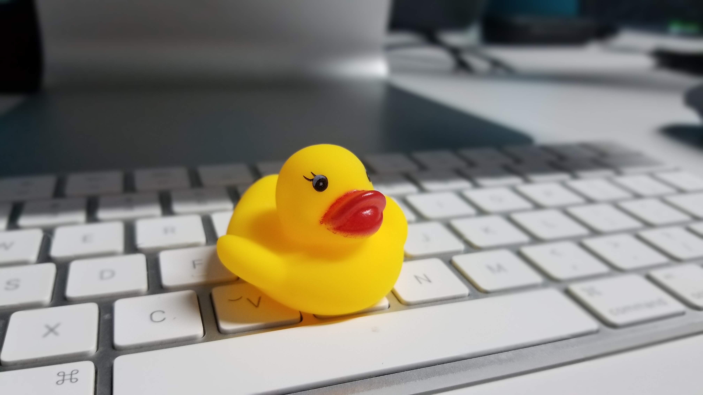

Si estas pensando o en proceso de aprender algo nuevo de forma independiente estos tips podrían servirte.

Por mi parte, aunque cuento con un título universitario, mis conocimientos de programación y mi pasión por la web fuero adquiridas aprendiendo por mi cuenta. Realmente me encanta ser autodidacta y creo que todo el mundo debería tomar el tiempo de aprender por su cuenta algo específico.

Digo algo específico porque probablemente en algún punto de nuestra vida hemos tenido que aprender algo por nuestra cuenta, ya sea por necesidad o por decisión. **Como desarrolladores nuestro trabajo es estar en constante evolución**, no estancarnos en una tecnología o forma de pensamiento.

Aunque podríamos tomar todos los cursos del mundo de una forma tradicional, es posible que esto sea un problema para nuestra cartera, o que el tiempo que podamos dedicar a aprender no se ajuste al de los demás (ejemplo no hay clases de noche o no hay tantas personas interesadas en el tema que queremos).

Tanto si ya has decidido aprender por tu cuenta como si no, este post es una introducción a como hacerlo para sacar el mayor provecho.

> Me referiré a _aprender independiente_ a cualquier forma que no dependa de una institución o instructor. Esto es: leer libros, ver videos, leer blogs. También incluyo los tipos de clases que optamos por tomar: Workshops, Meetups, Crash Courses, etc.

## Las ventajas de aprender independiente

Si aún no estás convencido del todo si debes o no dedicar tiempo consiente a aprender algo por ti mismo considera esto:

1. **Puedes hacerlo en tu propio tiempo:** No tienes que esperar a nadie para hacerlo, **si tú tienes el tiempo** para hacerlo entonces puedes. El internet nos ha dado acceso a un sin fin de contenido dispoible 24/7.
2. **Puedes estudiar lo que quieras:** Es difícil conseguir un grupo de personas para aprender algún [nicho](https://es.wikipedia.org/wiki/Nicho_de_mercado), y más difícil aún encontrar un buen profesor.
3. **Puedes llegar a conocerte mejor:** veremos este punto [más detallado abajo](#1-descubre-como-aprendes-mejor), pero en resumen debes conocerte a ti mismo para poder aprender efectivamente.
4. **Independiente no es solo:** aunque puedes tomar cualquier clase o investigación por tu cuenta nada impide conseguir un par de compañeros que también tengan el interés y hacer un miniclub de estudios. Yo no lo he hecho, pero suena divertido.

<Caption align="center" className="close-caption">

Foto por [John Schnobrich](https://unsplash.com/@johnschno?utm_source=taverasmisael&utm_medium=referral&utm_content=creditCopyText)

</Caption>

5. **Es más económico:** esto depende claro, si estás pagando una certificación o un curso exclusivo, es probable que sea un poco más costoso, pero hay mucho material gratis o asequible. Cabe destacar que ninguna inversión en educarse a uno mismo es un desperdicio de dinero.
6. **Puedes aprender varias cosas más rápido:** no es necesario aprender solo una cosa a la vez, puedes tener un plan de estudios y tomar varias clases tipo escuela/universidad sin que estén relacionadas. En la universidad, por ejemplo, cuando tomamos una carrera, todas las materias serán enfocadas a dicha carrera. Cuando aprendes solo, por otro lado, puedes aprender programación, diseño y marketing a la vez.

## Dificultades de aprender independiente

No todo es color de rosas. Es bastante difícil aprender solo en realidad. Estos puntos hacen que muchas personas no lo intenten o lo intenten, pero a medio camino se devuelvan.

- **Por dónde empezar:** esta es la primera pregunta. En la escuela y universidad hay un instructor que diseña y planea las clases por adelantados y nosotros solo vamos a nutrirnos. En el caso de aprender independientes somos juez, jurado, ejecutor y acusado y es nuestra responsabilidad saber que queremos estudiar.
- **Disciplina:** A mi esta me resulta la más difícil de todas, ya que al final de cuenta es muy personal y aunque hay tips para ser más disciplinados la única forma de serlo es con compromiso.
- **Encontrar el tiempo:** esta es tanto para si deseas aprender en una clase tradicional o por tu cuenta, pero encontrar el tiempo para estudiar es difícil. Puede ser porque hay mucho trabajo, creemos que no necesitamos aprender algo nuevo, nos sentimos cómodos con lo que sabemos o sabrá Dios qué.

## Como sacar el mayor provecho al aprender independiente

<Caption align="center" className="close-caption">

Foto por [NESA by Makers](https://unsplash.com/@nesabymakers?utm_source=taverasmisaesl&utm_medium=referral&utm_content=creditCopyText)

</Caption>

### 1. Descubre cómo aprendes mejor

Cada uno de nosotros tiene su propio [estilo de aprendizaje](https://psicologiaymente.com/desarrollo/estilos-de-aprendizaje). Aunque son varios, los 3 principales son: _visual, auditivo y kinestésico_. Para sacar mayor provecho de lo que estamos aprendiendo debemos entender cuál es el método que mejor nos funciona.

1. **Visual:** Aprendemos viendo. Ya sean videos, otros haciendo las cosas. Se nos hace más fácil aprender las cosas con gráficos o imágenes. Recomiendo video tutoriales, libros, blogs e incluso comics.
2. **Aditivito:** El oído es todo. Preferimos escuchar, sabes prestar atención a las narrativas. Recomiendo: podcasts, audiolibros.
3. **Kinestésico:** Todo sobre movimiento. Para aprender nos resulta mejor tener movimientos, hacer una experiencia completa con el cuerpo y no solo con la mente. Recomiendo hacer mucho énfasis en el [punto 4](#4-practica-lo-aprendido).

Es completamente posible tener los 3 estilos de aprendizaje, aunque uno de ellos resaltará del resto, **a este debemos prestarle más atención**. Esta es otra ventaja de aprender independiente ya que en con los métodos tradicionales no podemos adaptar las lecciones a nuestro sistema de aprendizaje.

### 2. Elije que aprender

El mundo es tuyo y puedes aprender lo que desees cuando desees gracias al internet. Elegir que queremos aprender es crucial para nuestro éxito aprendiendo.

Toma un tema que te parezca interesante e inicia con una mirada global, luego pasa a lo básico y ve adentrándote en partes más especificas. De este modo tendrás un camino definido con puntos de control donde podrás validar tus conocimientos.

Si no estás seguro de que tema elegir, **haz una lista de los temas que más te llaman la atención**, luego busca temas de introducción o vistazos generales de cada uno, así podrás saber si realmente te interesa y si es el caso pues sigue los pasos que he dicho antes.

**¿Qué pasa si el tema realmente no me gustó?**

Si descubres que no era lo que esperabas, descuida, **siempre puedes cambiar de opinión**. Es otra de las ventajas de aprender por tu cuenta, eres el capitán de tu barco de enseñanza y puedes guiarlo a donde desees.

Por esto como regla general tengo que siempre intento encontrar cursos, videos, audios o posts gratis de un tema antes de comprometerme a pagar un curso. _No pago por un curso sobre un tema que no estoy seguro de que quiero aprender._

### 3. Maneja la cantidad que aprendes

La mejor forma de aprender es dividir lo que aprendemos en conceptos manejables y más pequeños. Esto simplifica el por dónde empezar y nos ayuda a mantenernos en el camino sin sentirnos abrumados por la mucha información. Es probable que lo que desees aprender tenga mucho contenido es por ello que ir aprendiendo de a poco con podemos garantizar que solo tomaremos tanto como podamos masticar y no nos cansemos antes de terminar.

### 4. Practica lo aprendido

Muchas personas sienten que no aprenden nada solos porque olvidan una parte fundamental del aprendizaje que es aplicar lo aprendido. La práctica es un método indudable para sellar nueva información. La forma como me gusta ir con esto es (usaré un tutorial como ejemplo):

1. **Ver** el video de principio a fin (me gusta a velocidad 2x).
2. Si es un ejercicio práctico intentar **reproducirlo**.
3. Intentar **usar lo aprendido en un ambiente similar**. Por ejemplo si estoy aprendiendo a hacer un "To-Do list" en React, mi implementación sería hacer una lista de compras.

> **Bonus tip: Escribir o tomar notas.** Para los ejercicios que no son tan prácticos esto es mejor, pero incuso para algunos tutoriales con ejemplos esto es bueno. Si eres [kinestésico](#1-descubre-como-aprendes-mejor) el hecho de escribir (con teclado o a lápiz) va a la par con tu Sistema de aprendizaje.

### 5. Enseña lo aprendido

No necesitas un aula con 60 alumnos para enseñar, ni mucho menos dar una charla o una conferencia. Puedes tomar un amigo que este ligeramente interesado en el tema y en vez de bombardearlo con tu vida personal ~~(de la cual también solo esta _ligeramente interesado_)~~ intenta explicarle lo aprendido.

En caso de no contar con amigos o la forma de como hacerlo, solo decirlo en voz alta y explicárselo [incluso a un pato de goma](/blog/mejorando-la-comunicacion) puede servir.

<Caption align="center" className="close-caption">

Foto por [Misael Taveras](https://taverasmisael.com/)

</Caption>

Esto ayuda a cimentar lo aprendido, pero también nos ayuda con la autoestima. En ocasiones pensamos que no hemos aprendido nada, pero una vez que lo explicamos en voz alta pasan una de dos cosas:

1. Nos damos cuentas que efectivamente no sabemos como explicarlo y puede que tengamos algunas lagunas que debemos vaciar (¿o es llenar? 🤔).
2. Hemos aprendido más de lo esperado y podemos enseñar a otros.

En ambos casos solo nos queda aprender más y mejorar para la próxima vez que nos toque explicar podamos hacerlo con toda propiedad como expertos en el tema, aunque no lo seamos.

### 6. Sacar el tiempo para aprender

Como mencione antes, es probable que estemos aprendiendo independiente sin darnos cuenta. Leyendo, viendo videos, escuchando podcasts y demás. Pero no lo hacemos de forma consiente y por ende es probable que no grabemos todo lo que aprendemos.

Tomando un tiempo para estudiar y enfocarnos durante ese periodo puede aumentar nuestras probabilidades de aprender. No tiene que ser mucho tiempo, con tomar **15-30 minutos al día y dedicarlos a aprender** sin distracciones, aplicando los puntos anteriores puede hacer la diferencia.

Mi método favorito para esto es hacerlo en las noches antes de dormir y luego primera hora en la mañana intentar aplicar un porciento de lo aprendido la noche anterior.

## Cosas para evitar cuando estamos aprendiendo independiente

- **Aprender demasiadas cosas a la vez.** Esto garantiza que no nos quememos y nos aburramos antes de tiempo.
- **Menospreciarnos durante el proceso.** Es normal sentir que vamos lentos o que no estamos aprendiendo, pero la paciencia pagará al final.
- C**ompararse con otros.** Si alguien aprendió lo mismo que tu en un fin de semana no quiere decir que debas aprenderlo así también. No es una competencia.
- **Forzarse a terminar.** Esto es algo común en los métodos tradicionales en los cuales era obligatorio terminar cosas que no nos producen interés o que antes sí pero ahora no, o que ya no le vemos provecho. Es otra ventaja de aprender independiente, es mejor dejarlo y cambiarlo por algo que si nos llame.
- **Cambiar constantemente.** Opuesto al anterior, pero el cambiar constantemente sin terminar de aprender algo puede ser causa de no haber [definido lo que deseamos aprender](#2-elije-que-aprender).

## Conclusión

Aprender de forma independiente es un proceso que no termina, es precioso y nos pone en contacto con nosotros mismos. **Te prometo que una vez que empieces a hacerlo bien (con propósito) sentirás la diferencia.**

Si pudiste darte cuenta, algunos tips incluso se pueden aplicar a la enseñanza tradicional, te invito a que los pruebes.

Si tienes tus propios tips que te han servido, o si has aplicado estos y has notado un cambio, me interesa saber como ha sido. [Déjame saber en Twitter](https://twitter.com/taverasmisael).
