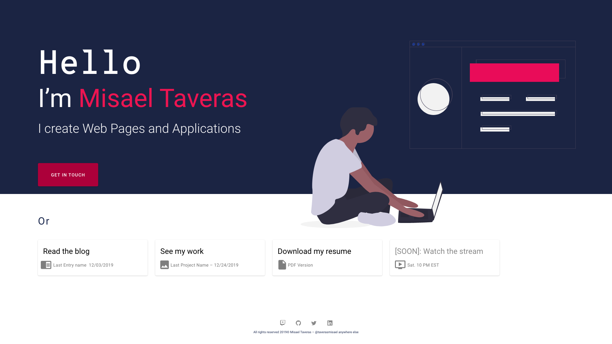
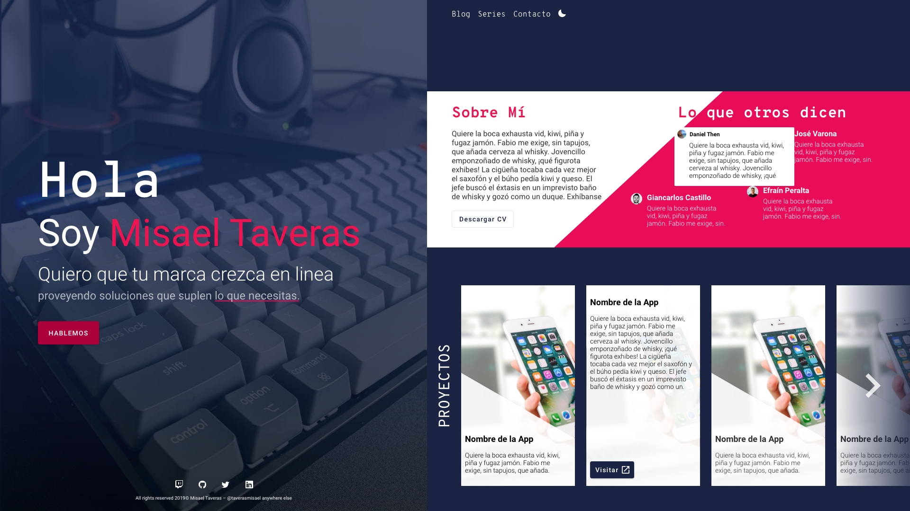
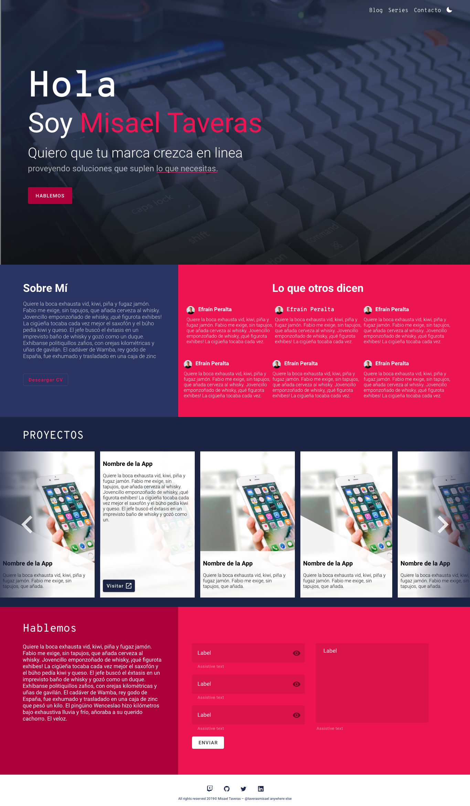

Nuevo año, nuevas metas, nuevo [podcast](/blog/anunciando-mi-podcast). Y para mí website, un nuevo diseño también.

Mi página de inicio no ha sido la mejor. El día del lanzamiento era literalmente la lista de posts del blog y ya, luego con el tiempo, y como prometí en ese [primer post](/blog/lanzando-mi-página-hoy) he ido agregando cosas, y mejorando la experiencia en general.

Hasta hace poco, el home era un breve resumen de mí y los posts más recientes, los cuales cambian cada vez que se sube un post nuevo. Esto no es directamente malo, pero era algo que no me convencía ya que no quiero que esto sea solo mi blog, sino que también deseo utilizarlo como mi página personal, donde pueda hablar de mí, exponer quién soy y ponerme en contacto con ustedes a la vez que muestro mi portafolio.

## Un home sencillo

Mis requerimientos eran simples: un home donde no saliera mi cara, con un footer más sencillo y elegante, donde pudiera exponer en lo que estoy trabajando sin ser muy detallado.
Debo confesar que **no soy diseñador**, así que tome **Adobe XD**, que es mi herramienta predilecta, y empecé a poner algunos bloques que hicieran algo de sentido. Me encontré con la página de [undraw](https://undraw.co/) de donde saqué el diseño que utilicé.

### Lo que aprendí

* **Adobe XD** hace sencillo diseñar interfaces simples aún para alguien como yo con solo algunas nociones básicas de diseño.
* **Colores**: Recientemente descubrí que los colores que utilizo en mi website son inspirados de mi equipo favorito de la [OWL](https://overwatchleague.com/en-us), [New York Excelsior](https://twitter.com/nyxl) así que decidí oficialmente adoptarlos como los colores de mi marca. (Estos son: #1c2444 (azul) y #ed1250 (rosado) y sus respectivos shades).
* **Tipografía**: Siempre me ha gustado como se ven las fuentes mono espacio, pero algunas se ven mejores que otras y las que se ven más SUPER MEJORES son ~~MUY~~ [algo costosas](https://www.typography.com/fonts/operator/overview) o no son amigables para lectura. Por esto cuando me encontré con [Overpass Mono](https://fonts.google.com/specimen/Overpass+Mono) no la pude dejar. Mi otra fuente es **Roboto**, que ha sido mi predilecta sans-serif desde la primera versión de Material Design (aunque estoy considerando cambiarla, **se aceptan sugerencias**).
* Que tenía **más cosas que mostrar** que no cabían en un single page section *full height 1 link por mega latino*. Así que el diseño iba a tener que evolucionar, aunque si me gustaba que fuera una simple página con una sola sección con toda la info necesaria.

## La versión 2.0

Está versión va adaptándose más a la que termino siendo oficialmente la versión final y es la que está ahora. Aún así tuvo sus fallos y sus aciertos.
Me había casado con la idea de que fuera una página con una sola sección grande. Pero había recolectado inspiración de otros lugares, como la página de mi amigo [José Varona](https://jvarona.tech/) donde tenía una parte de testimonios, quería hablar algo de mí, y quería **mostrar mis proyectos**.

### Lo que salió mal

* Hay que admitir que los [diseños asimétricos](https://cssdesignawards.com/sites/em-lyon-junior-conseil/35904/) son mucho más difíciles y para un novato como yo, casi imposibles de hacer.
* El espacio en blanco es bueno, pero el exceso **hace que se vea todo vacío.**
* Honestamente se ve desordenado como que el diseño está _all over the place_.
* Una **sección de contactos** hubiese sido excelente.
* En toda la página las formas son simétricas, lineas rectas, sin embargo aquí me fui por una opción "partida" que **no combina con lo demás**.
* La parte de testimonios no encajaba y se veía **muy pequeña**.
* Otro error que cometí en ambos diseños es que **estaba diseñando a 1920x1080** cuando esa no es la resolución que la mayoría de usuarios visita mi website (esa sería 1366x768) y eso lo aprendí a las malas.
* En móvil iba a tener que ser como quiera una página que se le hiciera scroll como quiera.
* WTF con ese texto vertical.

#### Teniendo todas esas consideraciones en mente empecé a trabajar en la siguiente versión.

> Aunque esté solo mostrando las imágenes, parezca que solo diseñé y muchos de los errores sean más que evidentes, debo confesar que **llevé a cabo cada una de estas ideas al menos a un 80%** y esto se puede ver reflejado en el [Git history](https://github.com/taverasmisael/taverasmisael/pull/38/commits) de este feature.

## La tercera es la vencida

Al fin una que remediaba todos los otros errores y **agregaba algo de sabor.**

Esta vez diseñé a **1366x768** y tuve en mente los diferentes tamaños de pantalla (desde 360px hasta 1920px). Conservé también algunas partes del otro diseño, como el gran HeroIntro section (con la imagen de mi escritorio). Le di más protagonismo a mis colores, deshaciéndome (casi) por completo del fondo blanco clásico.

Convertí el carrusel de proyectos en uno a ancho completo y me deshice del texto vertical. Reutilicé el [formulario de contacto](/contacto) pero le cambié el layout y agregué más opciones al selector de Razón.

### Retos de este diseño y diferencias

* **Son más secciones** así que era más código, más componentes, más estilos, pero se ve mejor en mi opinión.
* **La data**: Este website está creado con [Gatsby](https://www.gatsbyjs.org/showcase/taverasmisael.com) y  la data se alimenta del sistema de archivos. Literalmente **cada Post es un [archivo](https://github.com/taverasmisael/taverasmisael/tree/master/posts) de markdown** en la carpeta `posts`. Ahora necesitaba tener **testimonios** y **proyectos**, que fueran fáciles de agregar, editar y eliminar; cada uno con sus campos especificos. En mis planes está migrar aun [headless CMS](https://css-tricks.com/a-headless-cms-for-you-and-your-web-development-agency/), pero eso se salía del scope de rediseñar el landing, así que tuve que crear otras carpetas y repetir el proceso para traer la nueva información.
* **El carrusel**: Si han tenido el placer de ver la página en acción ([es el home de este blog](/)) notarán que el carrusel de proyectos no es un carrusel sino simplemente columnas, esto es porque ninguna solución de carrusel me convencía y aunque llegué a implementar una con [GlideJS](https://glidejs.com/docs/) no era muy amistosa con `gatsby-background-image` así que fue una de esas situaciones donde **sacrificas funcionalidad por tiempo y usabilidad**. No niego que en un futuro implemente el carrusel.
* **Escribir sobre mí.** Sí, creo que este fue uno de los mayores retos. No sé cómo escribir sobre mi, así que literalmente lo último que se quitó fue el dummy text para agregar mi copy. Escribir esos párrafos fue un reto para mi.
* **No hay menú**: Esto es algo que voy a agregar más adelante, espero que pronto. Sería un menú específico para el Home y sería dinámico.
* ~~**El tema del website no afecta el diseño**, me gustaría crear una versión *light* de este landing más adelante.~~ Esto ya es posible :3.
* **Dejé las líneas diagonales** para la parte de proyectos y agregué unos emojis 👀.

> La única parte que se puede decir que se mantuvo desde la versión 1 de este diseño fue el **footer**.

## En conclusión

Aquí pude explorar diferentes ambientes y hacer un rediseño con el que me siento satisfecho y del que sé tendré que mejorar en el futuro (cercano) y me siento satisfecho con eso.

Quiero agradecer a quienes se tomaron su tiempo y me escribieron para la sección de Testimonios. [Giancarlos](https://github.com/giancastle), [Efraín](https://github.com/efraa), [Daniel](https://www.linkedin.com/in/danielthenm/), [José](https://github.com/jvarona05). Pero en especial a **Efraín** que es la única persona que vio los 3 diseños y desde siempre me ayudó y motivó a terminar; de hecho de él fue la idea de completarlo antes de mi charla para [ReactRD.](https://github.com/React-rd)

> **Anuncio**: Estaré dando una charla sobre Custom React Hooks para la comunidad de **ReactRD** este 21 de febrero. Entérate de más en [EventTribe](https://www.eventbrite.com/e/better-components-with-custom-hooks-react-rd-tickets-93961847415) (es Gratis).

Si quieres compartir tu opinión del diseño, como siempre **puedes encontrarme en Twitter [@taverasmisael](https://twitter.com/taverasmisael)** o puedes hacerlo a través de la [página de contacto](/contacto). También me gustaría hacer otros casos de uso, así que si te gustó el formato avísame.

Hasta la próxima ~~que probablemente sea sobre el lanzamiento del podcast~~.
