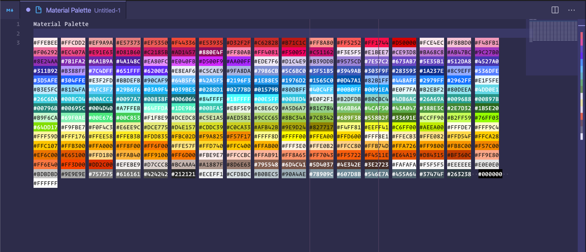

Hola y bienvenid@. Espero que lo estés pasando bien, que si estás en el presente te cuides, y si vienes del futuro felicidades por sobrevivir. Espero que no seas un T-1000 ni nada así (sin ofender a los cyborgs).

Ya en el pasado he hablado de algunas extensiones que me parecen esenciales a la hora de usar Visual Studio Code, te dejo el [link acá](/blog/8-extensiones-esenciales-para-vscode "8+ Extensiones escenciales para vscode"). En esta oportunidad listaré algunas extensiones y temas, que si bien no son necesarias, ni agregan ninguna _"funcionalidad"_ sí que son buenas a la hora de personalizar nuestro espacio de trabajo.

> Aclaro que esta lista de extensiones las uso, quizás no a diario ni todas a la vez (solo se puede tener un tema activo al mismo tiempo). Así que no es una lista sacada de Internet ni mucho menos preparada para este post. Es solo y literalmente, mi opinión personal lo que uso. Una vez aclarado esto, comencemos.

## Temas

Como mencionaba anteriormente, y como todos sabemos, no se pueden tener varios temas al mismo tiempo, y siempre hay un favorito que es el que usamos. A mí me gusta tener las opciones abiertas y algunos días ya sea para descansar los ojos, o para probar algo nuevo, o porque me siento diferente, me gusta probar ciertos temas. Los temas listados aquí son mis _"Temas de Reservas"_ que tengo instalados y solo es darle a cambiar tema. Diré cual es mi favorito y el que el 90% del tiempo tengo activo.

### 1. Shades of Purple

Este es un tema interesante, se podría decir monocromo donde el morado es el rey. Aunque parezca súper estilo [Wesbos](https://wesbos.com/) el tema está desarrollado por un entusiasta de Visual Studio Code quien siempre lo tiene actualizado.

* Syntax Highlight: 10/10
* Actualizaciones: 10/10
* Mood: Alegre
* Esquema: Oscuro y brillante

[Ver en el marketplace][ShadesOfPurple]

### 2. Material Theme

Si has estado desarrollando un tiempo es muy posible que hayas visto este tema. No está en mi top porque personalmente lo veo más como un tipo Flat UI en vez de Material Design, pero cada quien su invierno.

> Este tema es tan estándar que yo lo considero el monokai de la nueva generación. Tiene ports **Oficiales** para todos los editores y terminales (incluso para Slack).

* Fama: 10/10
* Syntax Highlight: 9/10
* Mood: El que quieras es super personalizadle
* Customization: 8/10
* Combina con: Material Icons &==&

[Ver en el marketplace][MaterialTheme]

### 3. Night Owl

Creado por la poderosísima [Sarah Drasner](https://twitter.com/sarah_edo) es un tema hermoso y sencillo que a pesar de tener NIGHT en el nombre brinda una versión clara y una oscura que se ven bien donde el Azul es el color dominante.

* Recomendado: 9/10
* Syntax Highlight: 10/10
* Mood: Dark como la noche
* Personalización: 5/10

[Ver en el marketplace][NightOwl]

### 4. Horizon Theme

Los que son OGs del blog puede que les resulte familiar este tema, y es porque era el que utilizaba para los snippets de código en el blog.
Fue mi favorito un buen tiempo, el contraste, los colores de atardecer, bello todo. Y aunque ocupa un lugar en mi corazón (el segundo para ser precisos), me quedo con el que viene a continuación.

* Kawaii: 9/10
* Syntax: 10/10
* Mood: Feliz :3
* Te enamora: si/si

[Ver en el marketplace][HorizonTheme]

### 5. Noctis

Hay una frase: _"Es más barato por docena"_ y este tema lo lleva a la perfección. A diferencia de ser un tema con una versión clara/oscura o bold/italic como los demás este es una colección de nada más y nada menos que **11 temas, 3 claros y 8 oscuros** pensada para reducir la fatiga en los ojos y que los colores tengan un significado semántico que haga sentido.

Mi "sabor" favorito es Uva. Combina los colores tardiurnos de Horizon con los morados de Shades of Purple.

* Combo: 10/10
* Estilo: Todos/Algunos
* Recomendado: 10/10
* Bueno para: las personas que no saben CUAL tema quieren, ahi tienen uno para probar.

[Ver en el marketplace][Noctis]

### BONUS: MONO

Honestamente no sé qué decir. Es un tema en blanco o negro **sin NINGUN OTRO COLOR**, por eso el nombre es mono. Duré como tres meses enamorado de él. Es bueno para enfocarse en el trabajo con pocas distracciones.

* Blanco: 1/1
* Negro: 1/1
* Colores: 2/1000000000+
* Concentración: 10/10

[Ver en el marketplace][Mono]

## Extensiones

Ya que vimos los temas que van a hacer que nuestro editor se vea más elegante, atractivo o dark, veamos algunas extensiones que nos agregaran algún tipo de utilidad que nos hará hacer del VSCode nuestro nuevo hogar :3.

### 1. Rainbow Brackets & indent-rainbow

Voy directo con estos ya que salieron en el anterior post pero igual caben aquí y desde el día que los descubrí no puedo vivir sin ellos. Si quieres ver más detalles puedes [ir a mi otra entrada](blog/8-extensiones-esenciales-para-vscode#8-rainbow-brackets--indent-rainbow "Rainbow Brackets & Indent") pero en resumen hacen que los paréntesis, llaves, corchetes y guías de línea tengan colores que combinen, así es súper fácil darte cuenta cuando te falta uno o donde acaba otro.

[Ver Brackets en el marketplace][RainbowBrackets]

[Ver Indent en el marketplace][IndentRainbow]

### 2. Color Highlight

Para los que andamos escribiendo colores en diferentes formatos y lenguajes, este nos ayuda a poder visualizar tanto en el mini mapa como en el código en sí dichos colores ya renderizados. Podemos personalizar si los queremos ver como fondo (así los uso yo) como línea debajo del texto, o hacer que el código del color en sí sea de el color. Mind blowing, lo sé.

[Ver en el marketplace][ColorHighlight]

### 3. Peacock

Esta hermosísima extensión creada por nada y más y nada menos que John Papa es imprescindible cuando se estan manejando diferentes proyectos a la vez. Te permite colorear tus espacios de trabajo como un pavo real agregando colores de acento a las diferentes barras de herramientas y demás del editor.

La forma como lo uso es por ejemplo, el código del backend lo hago rojo, el frontend azul y así sucesivamente.

[Ver en el marketplace][Peacock]

### 4. vscode-spotify

Si hay algo que necesito sí o sí para trabajar es música, y mi plataforma favorita desde 2015 ha sido Spotify. No te voy a decir dònde ni còmo escuchar tu música, pero si usas Spotify (premium o no) necesitas esta extensión.

Con esta extensión puedes controlar el reproductor de Spotify desde el mismo VSCode, adelantar, devolver, pausar, ver tus listas de reproducción y tu librería e incluso buscar (en genius) las letras de la canción que está sonando sin salir del editor.
Esto tiene sus puntos fuertes y débiles como que solo está en Windows si eres usuario Premium :c

> Hay una extensión similar para los que usan Apple Music, pero como nunca he usado la plataforma, tampoco la extensión no puedo recomendarla, pero para que sepan que sí existe. [Éste es el enlace][VscodeItunes].

[Ver en el marketplace][VscodeSpotify]

### BONUS: Iconos, iconos y más iconos

Saben que me encanta agregar partes de bono a estas compilaciones y cuando hablamos de personalización no podemos dejar fuera los iconos. 
Como son tantos los voy alternando igual (aunque con menor regularidad) que los temas, los agruparé todos aquí con un breve resumen sin ningún orden particular y con imágenes de como se ven.

#### Material Icon Theme

De la mano con su tema del que hablamos hace un momento, estos temas son elegantes, sencillos y soportan casi todas las extensiones conocidas por el hombre.

[Ver en el marketplace][MaterialIconTheme]

#### Seedling Icon Theme

Más sencillo con un estilo aun más minimalista pero bien pulido. Un poco desactualizado :/

[Ver en el marketplace][SeedlingIconTheme]

#### VSCode Great Icons

Éste es el Horizon de mis Iconos jaja. Duré mucho tiempo utilizándolo y aún tiene un lugar principal en mi corazoncito. Está completo, se ven hermosos y bien acabados los iconos.

[Ver en el marketplace][VscodeGreatIcons]

#### VSCode simpler Icons with Angular

Y el último de la tanda y el que actualmente utilizo diariamente, es más completo y tiene soporte para los diferentes tipos de archivos utilizados por Angular (un icono para los servicios, para los módulos, para los componentes, etc.)
Aunque como dije, los alterno de vez en cuando.

[Ver en el marketplace][VscodeSimplerIcons]

## Conclusión

Espero que te hayan gustado las extensiones y temas que normalmente utilizo. Si hay algo más que te gustaría saber sobre mi setup, puedes preguntarme en [Twitter](https://twitter.com/taverasmisael) o en la página de [contacto](/contacto) y yo encantado de contestarte.

Dime que te pareció esta lista. ¿Ya conocías algunos, todos? ¿Cuál fue tu favorito? ¿Crees que me faltó alguno que te gusta? Déjame saber en [Twitter](https://twitter.com/taverasmisael), quisiera saber.

Nos vemos en la próxima entrada.

[ShadesOfPurple]: https://marketplace.visualstudio.com/items?itemName=ahmadawais.shades-of-purple
[MaterialTheme]: https://marketplace.visualstudio.com/items?itemName=Equinusocio.vsc-material-theme
[NightOwl]: https://marketplace.visualstudio.com/items?itemName=sdras.night-owl
[HorizonTheme]: https://marketplace.visualstudio.com/items?itemName=jolaleye.horizon-theme-vscode
[Noctis]: https://marketplace.visualstudio.com/items?itemName=liviuschera.noctis
[Mono]: https://marketplace.visualstudio.com/items?itemName=StepanVanzuriak.mono
[RainbowBrackets]: https://marketplace.visualstudio.com/items?itemName=2gua.rainbow-brackets
[IndentRainbow]: https://marketplace.visualstudio.com/items?itemName=2gua.rainbow-brackets
[ColorHighlight]: https://marketplace.visualstudio.com/items?itemName=naumovs.color-highlight
[Peacock]: https://marketplace.visualstudio.com/items?itemName=johnpapa.vscode-peacock
[VscodeSpotify]: https://marketplace.visualstudio.com/items?itemName=shyykoserhiy.vscode-spotify
[VscodeItunes]: https://marketplace.visualstudio.com/items?itemName=PsykoSoldi3r.itunes-vscode
[MaterialIconTheme]: https://marketplace.visualstudio.com/items?itemName=PKief.material-icon-theme
[SeedlingIconTheme]: https://marketplace.visualstudio.com/items?itemName=rastikerdar.vscode-seedling-icon-theme
[VscodeGreatIcons]: https://marketplace.visualstudio.com/items?itemName=emmanuelbeziat.vscode-great-icons
[VscodeSimplerIcons]: https://marketplace.visualstudio.com/items?itemName=davidbabel.vscode-simpler-icons