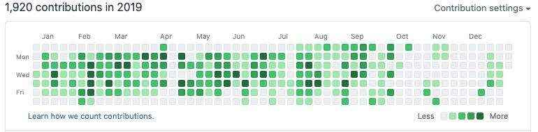

Hace unos años cada artículo que hablaba de tener un Portafolio como desarrolladores mencionaba tener tu perfil de GitHub inmaculado, bello, lleno de proyectos aunque estos fueran personales o no estuvieran completados. Esto (según nuestros ancestros) daba a los reclutadores y compañías una idea de como trabajabas, de que no estabas vago y que estabas trabajando.

Muchos de nosotros tomamos este consejo a pecho, y nos olvidamos de crear un portafolio real, hasta el punto que si nos preguntan por nuestros proyectos solemos responder con: _Están en mi Github_. Aunque esto es mejor que nada, no es óptimo y a la larga nos hace más mal que bien.

Yo podría acabar el post acá o simplemente hacer una lista detallada de porque a los reclutadores no les interesa saber como correr _"Unos simples comandos"_ mágicos y rezar porque tu código funcione, pero prefiero dividir el post en 3:

* Excusas y mitos comunes.
* Soluciones para hacer de Github nuestro portafolio.
* Soluciones para cuando estamos listo para subir al siguiente nivel.

**Spoiler:** Ya estás listo para el siguiente nivel.
> Estos consejos de portafolio pueden ser aplicados a cualquier tipo de programador/ingeniero de software y algunos hasta a otro tipos de creadores (artistas, músicos, etc.).

## Mitos y excusas frecuentes

Exploremos algunas de las razones por las que o no tenemos un portafolio ni creemos que GitHub es suficiente.

### Mito: El código en Github es tan factible como un portafolio

Esto más que un mito es una leyenda que una vez fue cierta. Entro en más detalles de por qué no es así y cómo convertir tu Github en un portafolio nivel 1 en los siguientes apartados, así que por ahora me limitaré a decir que un montón de código en un sitio **no es un portafolio**.

### Excusa: Apenas empiezo

Esta es la única excusa que catalogaré como _valida_ parcialmente. Y es que si no tienes nada que mostrar... pues no muestres nada.

Sin embargo, no descartemos nada. Si aún estás aprendiendo, hace sentido no tener un portafolio pues

* Literalmente aún no has hecho nada.
* Las empresas tienen un ojo puesto en ti y tus habilidades quieren que aprendas/crezcas con ellas (o explotarte, pero eso es un tema para otro día) así que **no necesitarás un portafolio detallado para aplicar a ellas.**

Mi consejo es que no te preocupes tanto por tu portafolio, aunque cuanto antes empieces a construirlo mejor. Mi sugerencia rápida sería que si estás tomando algún curso revises si puedes usar las asignaciones en tu portafolio y **de ser así hazlo, pero no solo las completes**, sino que también le agregues tu propio toque de modo que no se vean como tarea. Esto solo es aplicable mientras empiezas y a medida que vas creciendo **debes ir alejándote de usar tareas como portafolio.**

### Excusa: Soy desarrollador de [Tecnología no web], no necesito un portafolio online

El tener una presencia (y por ende un portafolio) online era un lujo o añadido hace unos año. Ahora mismo es una necesidad. No importa si eres web o no, los reclutadores, las empresas y tus compañeros intentarán validar tus aptitudes y se crearán una imagen (errónea o no) de ti en base a lo que vean online.

Cuando me escriben de una compañía no la busco en GitHub, intento ver si tienen una página web donde salgan sus proyectos, sus clientes y demás. Pasa también a la inversa. Cuando alguien nos busca a nosotros aunque seamos desarrolladores siempre van a querer ver lo que hemos hecho en acción antes que buscarnos en GitHub.

> _Mini aviso: Vivimos en el 2020 donde hay que aclarar LITERALMENTE TODO para que no se salga de contexto. Aclaro que este post está basado en experiencias personales y compartidas por otros compañeros. Como siempre, hay excepciones a las reglas. Así que el "casi siempre" está implícito en todos los casos. **Nunca algo pasa siempre; y eso es algo que siempre pasa.**_

### Excusa: Todos mis proyectos han sido privados y están sellados bajo contrato

Éste es un poco fuerte. En la mayoría de los casos cuando empezamos en un nuevo proyecto lo primero que hacemos es firmar un NDA (Acuerdo de confidencialidad) en el que aceptamos no hablar de lo que hagamos ni como lo hagamos.

Muchos clientes van aún más lejos y no nos permiten si quiera decir que trabajamos con ellos y ellos se _"toman todo el crédito"_ por nuestro trabajo. Es lo que firmamos y no tenemos problema con eso y aquí no sugeriré a nadie violentar ese acuerdo. Para las personas que venden licencias limitadas o no venden todos los derechos de su trabajo, pueden saltarse esta parte.

Personalmente yo duré casi un año trabajando y cuando entraba a mi perfil de Github se veía verde, pero al entrar en incógnito no se veía nada porque todos los comits, PRs y demás eran una organización privada.

Para los que estamos en esa situación tengo 2 consejos:

* **Crear proyectos personales:** no te límites solo a tu trabajo, si puedes hacer algo por tu cuenta, ponlo, es mejor, te dará más credibilidad, naturalmente. Pero recuerda seguir las guías que te dejo debajo, no basta con subir un proyecto personal.
* **Pregunta si hay partes de la app que puedes hacer públicas.** Me explico, puede que hayas creado una librería, un componente, algo modular que no está directamente conectado con el proyecto, sino que lo usas ahí. En ese caso **PRIMERO PREGUNTA** si puedes hacerlo como una librería de código abierto, eliminando claro está cualquier rastro de la organización para la que trabajes. Grandes proyectos como [Downshift](https://github.com/downshift-js/downshift) empezaron así.

De nuevo, no soy abogado y no sé los términos que tengas para con quien trabajas, así que **siempre consulta y asegúrate de haber tenido permiso por escrito antes de**, es lo menos que puedo aconsejarte para evitar futuros problemas.

Si quieres usar GitHub como tu portafolio, la razón por la que sea al menos ten lo siguiente en cuenta.

## Soluciones para usar GitHub como portafolio

Si estamos en la posición en la que creemos que GitHub es el portafolio que necesitamos, pues vamos a tener que convertirlo en portafolio y no solo en un **almacén de código.**

Digo almacén de código, porque yo mismo he sufrido de este síndrome que es que cada proyecto que inicio por más pequeño que sea, lo primero es hacer `git init` lo cual no está mal; el problema es cuando solo estamos experimentando, o empezando con algo y creamos también un repo en Github y subimos nuestro código sin terminar, sin optimizar. Luego pasa la vida y nos olvidamos de ese proyecto.

Cuando abrimos los ojos tenemos 20 repos en GitHub que si los licuamos no hacen media librería. Usamos GitHub como una nube para guardar nuestros proyectos, lo cual no está mal aunque si lo queremos usar como portafolio, tendremos que llevarlo al siguiente nivel; aquí los pasos para hacerlo.

* **Hazlo parte de tu marca personal**  la idea de un portafolio  es darnos a conocer,  mostrar quienes somos y que somos capaces de ofrecer. Por eso debe ser parte de nuestro branding. No voy a entrar en detalles de la marca personal, eso sería un post de por sí solo. Me limito a decir que debes **tener un nombre que signifique algo** (preferiblemente el tuyo) por el cual sea fácil de encontrarte. Usa una foto de perfil que te represente y por último, si intentas darte a conocer por tus habilidades en C++ considera **eliminar de tus repos destacados aquellos que no están relacionados con el lenguaje.**
* **Elimina repos viejos o incompletos** no tiene propósito el tener contenido irrelevante para tus metas, y los repos incompletos solo venden la imagen de que eres inconsistente y con falta de compromiso (aunque tú y yo sabemos que no lo eres :3). Si tienes algún apego sentimental a ellos, o planeas terminarlos algún día (yo creo en ti) **puedes archivarlos y así no aparecerán a perjudicar tu imagen.**
* **Trata a tus repos con respeto** crea una documentación, describe qué hace, qué pensabas al momento de hacerlo. No tienes que escribir el Quijote, pero con decir de que va, como correrlo en local, alguna configuración extra (como variables de entorno) las principales dependencias del proyecto o bugs conocidos. **Danos algo más que el código crudo.** Recuerda que para ti puede ser evidente, pero es porque tú lo creaste y has estado ahí desde el momento cero.
* **Debes ser activo en la plataforma** Github no solo es un almacén de código, es una red social para desarrolladores. Da estrellas a repos que creas interesantes, crea issues, abre PRs, comenta en issues de otros.
* **Saca provecho de GitHub pages:** para cerrar este capítulo y abrir espacio para el siguiente, debo decirte que GitHub pages es gratuito y hay cientos de plantillas sencillas. Si no puedes crear una página para cada proyecto al menos asegúrate de tener la tuya (`[tunombre].github.io`) y en ella agregar tus mejores repos y enlaces a tus redes sociales. Eso te ayudará con tu marca y créeme que **a papi Google le gusta esto.**

## Teniendo un portafolio más completo

Me alegro que hayas decidido escalar al siguiente nivel de portafolio. ¿Qué aún no te he convencido del porqué? Creo que tienes razón, me centré más en las excusas y en soluciones temporales que olvidé el verdadero propósito.

#### Bueno la razón por la que tu GitHub no cuenta como portafolio es porque a los reclutadores, las compañías ni a nadie le importa tu código crudo.

* GitHub es un lugar de subir proyectos, pero el código no corre solo, aun así sean páginas, aplicaciones, librerías deben ser compiladas, procesadas, ejecutadas y nadie tiene tiempo para eso.
* Debido a que la mayoría de nuestro _trabajo épico_ puede estar detrás de un NDA o en una Intranet, el código que tendremos en Github serían proyectos personales (algunos ni tan serios si no hemos seguido los consejos anteriores).

En este caso lo que debemos  hacer es elevar nuestro portafolio al siguiente nivel exponiéndolos en una página web donde se pueda ver el proyecto terminado y no el código bruto.

> Todos los consejos anteriores sobre el branding, no subir  cualquier cosa a GitHub sigue siendo real. Esto de acá más que un sustituto es un complemento.

Mi sugerencia, luego que depures tu perfil en GitHub (o durante) es que crees casos de usos y documentes tus proyectos. **Es más interesante saber que te llevó a esa solución que la solución de por sí.**

* **Para proyectos web (frontend)** puedes usar [Github Pages](https://pages.github.com/) para alojar la versión final donde utilizas o corres tu aplicación / librería.
* **Para proyectos web (backend)** puedes usar la versión gratis de [Heroku](https://www.heroku.com/) para que se pueda acceder a tu código.
* **Para proyectos que no pueden alojarse** como apps y demás, crea mini vídeos donde se puedan ver en acción y súbelos a una plataforma como YouTube o Vimeo. Es 2020 y esto es más sencillo que nunca, pero podemos hacer una guía si es necesario.

> El problemas es que nadie va a poner en google: **Proyectos de Misael Taveras online DEMOS 1 link mega español (latino) sub incrustados**.

Para que las personas sí puedan encontrarte necesitarás un lugar donde recolectar todos tus demos, proyectos, donde escribir y detallar esos casos de usos de los que hablábamos. Ahí es donde entra el tener tu página web, que como comentaba al principio, **hace más de 10 años que tenerla no es un lujo ni un extra sino una necesidad.**

A pesar de que existen plataformas que te permiten hacer tu página arrastrando y soltando elementos, sabemos que no es lo mismo que una experiencia personalizada y optimizada.

Entre tanto crear código y subir repos a tu perfil de Github es probable que no tengas el tiempo necesario para dedicarle a la creación de tu portafolio online. **Por suerte conoces a alguien que trabaja haciendo esas cosas.**

Me encataría verte crecer y que pases de tener un montón de código sin propósito en Github a que puedas tener tu propia web y expongas lo mejor de ti. Puede dar miedo al principio, yo aún lo tengo, pero los beneficios son incalculables.

Si crees que yo puedo ayudarte escríbeme desde [mi página de contacto](/contacto) y podemos programar una reunión de 15 minutos sin ningún tipo de compromiso. En esa reunión podemos hablar de como mejorar tu presencia online, como mejorar tu imagen en Github o de **el genial portafolio que te gustaría tener.**

## Conclusión

Estos consejos, como dije, los he sacado de mi experiencia y de compañeros que han compartido sus historias conmigo. **No son la ley absoluta pero sí que tienen su beneficio.**

Me gustaría saber cuál de estas cosas ya hacías y si te funcionaban; o si las estás poniendo en práctica cuál ha sido tu experiencia. Ya sabes que si quieres hablarme puedes encontrarme en Twitter como [@taverasmisael](https://twitter.com/taverasmisael) y si estás listo para llevar tu portafolio al siguiente nivel escríbeme desde mi página de [contacto](/contacto) y con gusto responderé a tus dudas.

