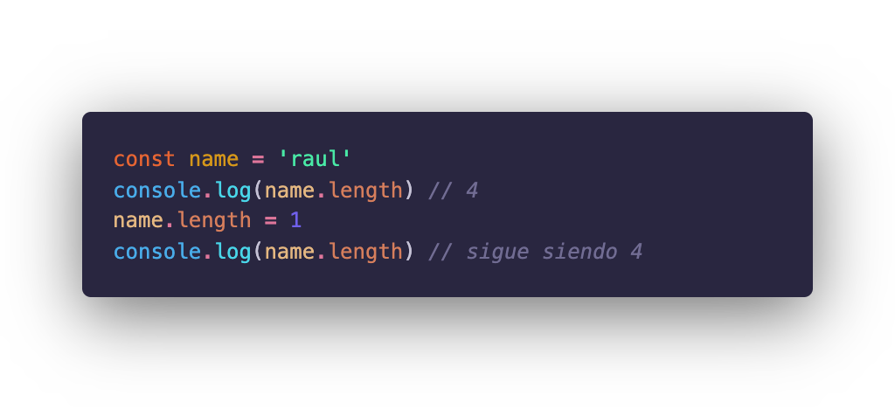
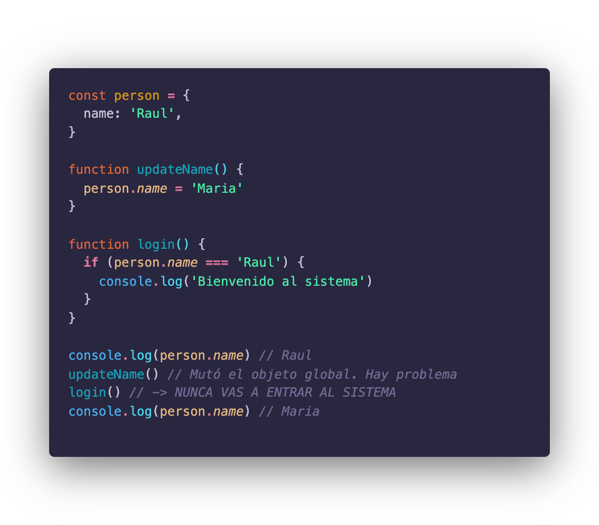
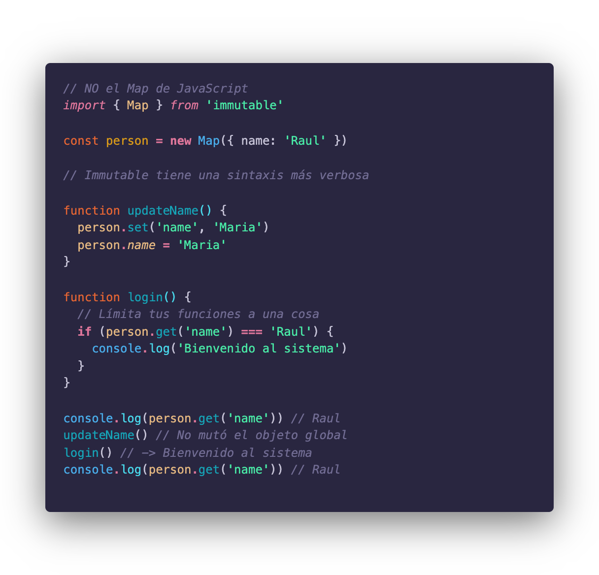
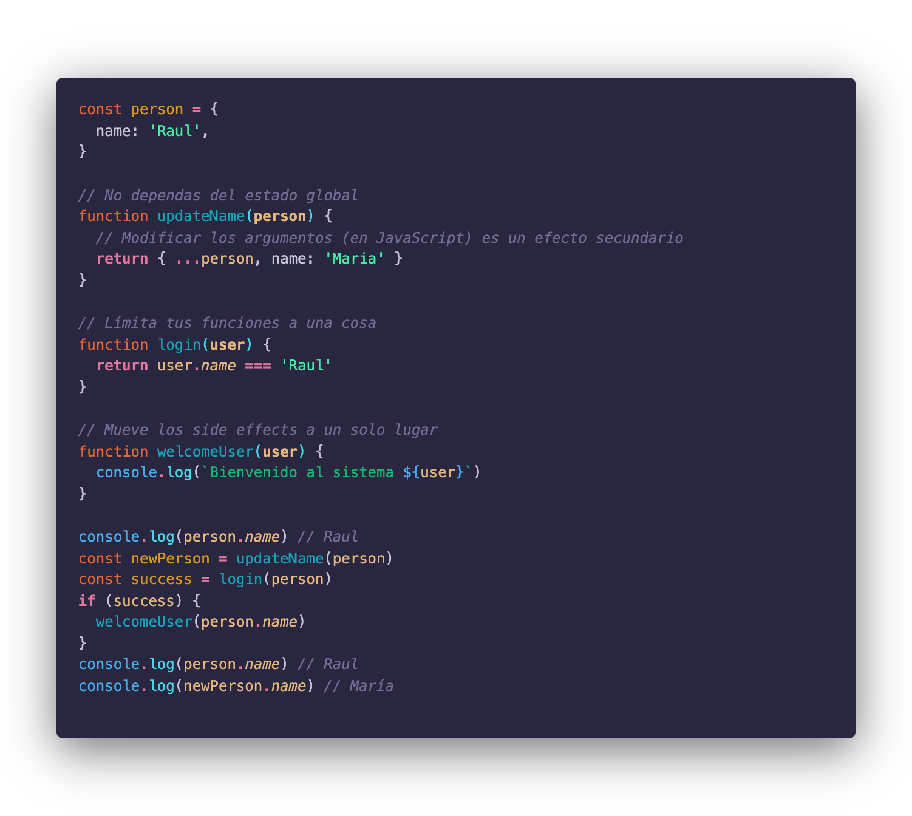

La programación funcional es un paradigma que me apasiona. No me declaro el mejor, ni un experto, a lo mucho un aficionado; y aunque hace mucho tiempo ya que no me sumerjo como solía hacer, un post (o una serie) de conceptos fundamentales me ayudaría a refrescar mi memoria y retomar el buen camino.

<Blockquote type="disclaimer">

El contexto de el post va a estar en JavaScript, que si bien no es un lenguaje puramente funcional su naturaleza nos permite aplicar la mayoría de estos patrones, ya sea directamente o a través de librerías.

</Blockquote>

## Programación funcional

En su definición más básica, es un paradigma de programación que utiliza datos **inmutables** para **componer** funciones **puras** evitando los **efectos secundarios**.

Es un poco de vocabulario que procesar, y naturalmente hay más de la programación funcional que solo este puñado de elementos, pero creo que son los pilares sobre los que se construyen los demás y es por esto que hoy vamos a ver lo que he denominado el ISP (usaré vocabulario en inglés en ocasiones porque es como mayormente se encuentra la terminología).

**Immutability + Side Effects + Purity = ISP**

> _No permitas que las palabras nuevas te intimiden, son más fáciles de lo que suenan._   Eric Elliot, [Master the JavaScript Interview: What is Functional Programming?]((https://medium.com/javascript-scene/master-the-javascript-interview-what-is-functional-programming-7f218c68b3a0#e84e))

## 1. Inmutabilidad - Immutability

Un valor inmutable es aquel que no puede cambiar una vez que fue creado.

En JavaScript hay dos tipos de valores, primitivos y objetos. Todos los valores primitivos son inmutables

<Caption
  align="center"
  footNote="Cambiarle el length a un string manualmente no modifica realmente el valor"
>

Cambiarle el length a un string manualmente no modifica realmente el valor

</Caption>

Los objetos por otro lado no lo son. Recordar que en JavaScript los arrays, las funciones y naturalmente los objetos **todos son objetos en el fondo**. Esto complica ligeramente el trabajar con un paradigma funcional cuando la mayor parte de los valores con los que interactuamos son mutables.

Para ayudar la crisis de inmutabilidad en JavaScript existen unas cuantas librerías que permiten tener objetos inmutables a partir de valores mutables. La más popular de esta [Immutable.js](https://immutable-js.github.io/immutable-js/) (por Facebook). Otra famosa pero algo desactualizada (desde 2015) es [Mori](https://github.com/swannodette/mori). Si quieres una lista con las librerías disponibles [acá te dejo un enlace](https://gist.github.com/camsong/33983cdf8371cf9ecdce).

Cabe destacar que aunque JavaScript ha introducido recientemente las `const` esto no indica inmutabilidad como pudimos ver en el ejemplo anterior con el `name`.

JavaScript nos permite crear o trabajar de forma *inmutable* con los objetos sin utilizar ninguna librería utilizando métodos como [map, filter, reduce](/blog/usar-map-filter-y-reduce-para-olvidarnos-de-los-bucles-for) en los arrays y [object destructuring](/blog/javascript-todo-lo-nuevo-desde-es6-hasta-hoy-parte-1#destructuring).

### La razón de la inmutabilidad

En la programación funcional la inmutabilidad es lo que hace que los demás conceptos funcionen. Si nuestra data fuera mutable la composición de funciones colapsaría y podríamos fallar en no tener estado compartidom, que es otro de los pilares de la programación funcional.

Una de las principales desventajas de la mutabilidad es que nos hace vulnerables a que las funciones que utilizan la data colisionen una con otra.

<Caption
  align="center"
  footNote="Un ejemplo de que usar `const` no hace que el código sea inmutable mostrando los peligros de usar estado compartido y valores mutables."
>

Un ejemplo de que usar `const` no hace que el código sea inmutable mostrando los peligros de usar estado compartido y valores mutables.

</Caption>

En este ejemplo una **CONSTANTE** global `person` se crea con el nombre de 'Raul'. La función `login` está esperando que el nombre de la persona tiene 'Raul', pero justo antes se llamó la función `updateName` que modifica la constante global, por lo que la función `login` va a fallar y nadie sabrá porqué.

Este ejemplo aunque exagerado y algo tonto, se ve en código en producción en muchas aplicaciones. Por supuesto que la llamada a `updateName` y `login` puede que no estén en el mismo archivo incluso, al usar valores mutables y estado compartido hacemos que ninguna de las dos funciones sepa realmente el daño que está haciendo al resto de la app.

<Caption
  align="center"
  footNote="El mismo ejemplo anterior pero utilizando Immutable.js"
>

El mismo ejemplo anterior pero utilizando Immutable.js

</Caption>

En este caso aunque la sintaxis es un poco más larga podemos ver que no hay forma de que la función `updateName` mute nuestro objeto immutable de ninguna manera. Así que se puede decir que la función `updateName` (mejorada) no tiene Efectos Secundarios.

## 2. Efectos secundarios - Side Effects

*Nauseas, mareos y dolores de cabeza son algunos efectos secundarios de ciertos medicamentos.* Se puede decir que **un efecto secundario es cualquier cambio observable fuera de la intención del producto.**

En la programación funcional **un efecto secundario es cualquier cambio en el estado/comportamiento de la aplicación observable fuera de la función en la que se ejecuta.** En algunas ocasiones los efectos secundarios son evidentes y en otros un poco más sutiles.

Continuando con nuestro ejemplo anterior (el primero, mutable) en ambas funciones podemos observar efectos secundarios. La función `updateName` no recibe ningún parámetro por lo que modifica el estado global de nuestra aplicación causando un efecto no deseado en la función `login`. La función login por otro lado (en ambos casos) tiene un efecto secundario un poco más sutil, en especial cuando estamos iniciando con la programación funcional, y es que hace `log` en la consola, algo que está fuera del alcance de ella.

Una lista de los efectos secundarios más comunes es:

* Modificar, crear o eliminar cualquier variable fuera del _scope_ de nuestra función.
* Mostrar información por la consola.
* Escribir o imprimir por pantalla o a algún archivo.
* Hacer una llamada a la red.
* Iniciar o correr procesos externos.
* Hacer llamadas a la base de datos
* Llamar a una función con efectos secundarios.

Si lo vemos así e intentamos evitar los efectos secundarios como evitamos los valores mutables nuestros programas serían aburridos y solo serían un montón de funciones que se pasaran información entre ellas sin que el usuario supiera lo que está pasando.

Es por esto que l**os efectos secundarios NO SE ELIMINAN, SE CONTROLAN.** No existe un programa que pueda existir sin efectos secundarios. Nuestro trabajo como desarrolladores está en controlar y minimizar estos efectos secundarios.

Una de las técnicas más importantes es la de **aplazar los efectos secundarios hasta que sean estrictamente necesarios.** En conjunto con esto podemos mover todos los efectos secundarios a un solo lugar y de ese modo tener más control sobre dónde y cuándo ocurren.

Veamos nuestro código de arriba con efectos secundarios minimizados (sin necesidad de librerías)

<Caption
  align="center"
  footNote=""
>

Hemos modificado nuestro código para tener menos side effects dejando solo el necesario de mostrar por consola.

</Caption>

Como podemos observar no solo hemos reducido los efectos secundarios a solo lo necesario y lo hemos movido a su propia función, sino que "sin querer" hemos implementado inmutabilidad ya que `person` sigue siendo `"Raul"` y `"Maria"` es `newPerson`.

<Blockquote type="info">

No estoy utilizando arrow functions aquí para poder comentar mejor en los snippets, pero en los ejemplos de código directo si estoy usando arrow function. En este caso las arrow functions y las clásicas funcionan igual. Para saber más sobre la no tan nueva sintaxis te dejo **[un enlace acá](/blog/javascript-todo-lo-nuevo-desde-es6-hasta-hoy-parte-1#arrow-functions).**

</Blockquote>

## 3. Pureza - Purity

Si haz seguido los ejemplos hasta acá **ya utilizaste function purity y ni cuenta te diste.** Felicidades. Puedes pasar a recoger tu diploma de iniciado en la programación funcional en tu centro más cercano. **Recuerda usar mascarilla.**

> **Una función pura** es aquella que dados los mismos argumentos da el mismo resultado (SIEMPRE) y que no tiene efectos secundarios.

Viendo el último fragmento de código, ¿Puedes identificar las funciones puras? Si dijiste todas menos `welcomeUser` felicidades estás en lo correcto 🥳🥳.

Usualmente se toma la función de suma `(a, b) => a + b` ya que es el perfecto ejemplo de una función pura sencilla, pero que sea pura no significa que deba ser sencilla, solo consistente.

Aquí es donde la inmutabilidad cobra peso (al igual que evitar los efectos secundarios) ya que con data mutable es difícil e impredecible crear funciones puras de forma consistente y con seguridad.

Al igual que con los efectos secundarios un programa de solo funciones puras no es nada interesante ya que al no poder crear efectos secundarios ni llamar a funciones que los contengan, limitan lo que podemos hacer. Es por esto que al igual que con los side effects debemos limitarlos a los necesarios, controlarlos y si es posible agruparlos.

### Ventajas de la funciones puras

* Son más fáciles de testear
* Promueven los demás pilares de la programación funcional.
* Nos permiten componer funciones de forma más sencilla y eficiente.

## Conclusión

Aún queda mucho más de la programación funcional que definir y yo estaré más que encantado de traértela. Espero que hayas aprendido o se te haya refrescado la memoría sobre la programación funcional.

Si te interesa saber más sobre la programación funcional y a que me refiero con componer funciones únete a lista de correo (**NUEVA**) aquí debajo, donde podrás enterarte de noticias, cuando suba nuevo contenido al blog o [al podcast](https://www.instagram.com/releaseonfridays/).

Estaré compilando contenido interesante y lo enviaré por ahí. **Solo cosas buenas, no SPAM, no vender tu información** ~~(a menos que sea por una cantidad tan considerable de dinero que literalmente pueda enviarle un porcentaje a cada uno de ustedes y quedarme con una parte tan grande que me desaparezca por completo del mapa)~~.
