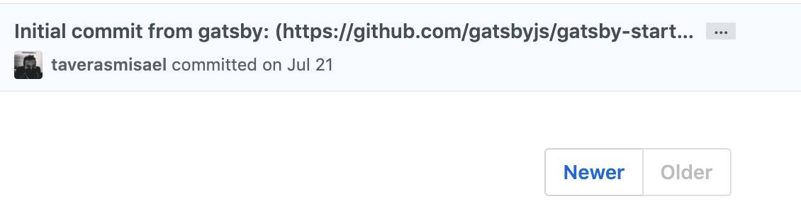
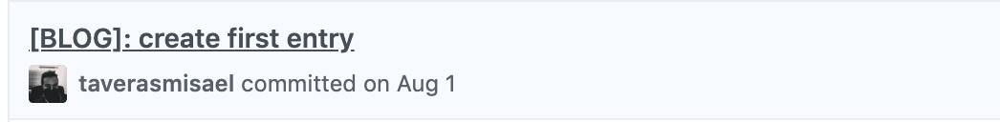
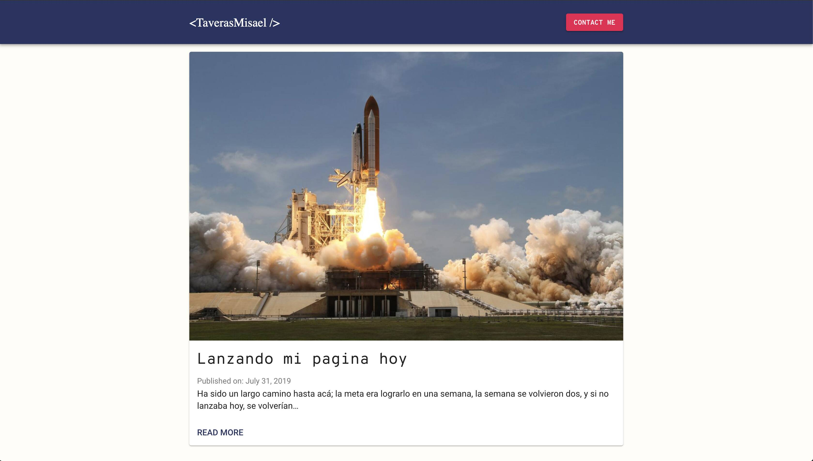
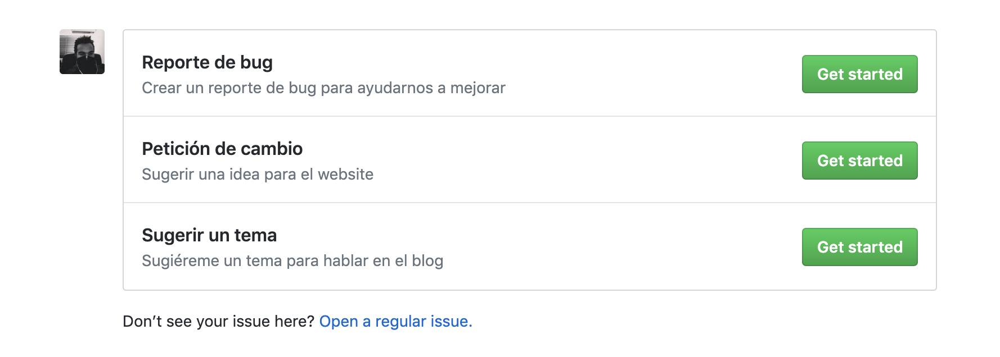
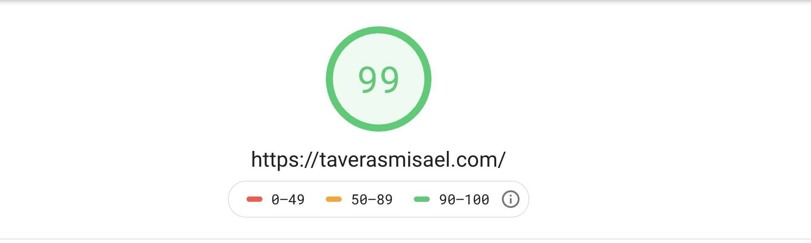

<Caption footNote="primer-commit" align="center">

El primer commit para este blog fue creado por Gatsby el 21 de Julio

</Caption>

La razón inicial por la que creé el blog fue porque sentí la necesidad de compartir mis conocimientos con los demás y ganar exposición. Todo inició como parte de 30 días de commits (no relacionado con el trabajo) pero luego se volvió una prioridad en mi vida.
En este post explico todo lo que ha pasado desde el primer commit hasta hoy, que planes hay para el futuro y como ha sido la experiencia.
> **Disclaimer** Este es un post solo compartiendo mi experiencia teniendo un blog activo por 2 meses y como pasó de ser un proyecto secundario a ser mi prioridad, como despertó mi curiosidad y me ha llevado a aprender otras cosas. Así que siéntete libre de esperar hasta la próxima semana donde estaré compartiendo más del contenido acostumbrado.

## El inicio

Como expliqué en mi [primer artículo](/blog/lanzando-mi-pagina-hoy), al inicio de los 30 días de commit había iniciado con un proyecto con Angular para refrescar mi mente con el framework y cubrir una “necesidad” que tenía en el momento. Todo iba bien pero rápidamente me desencanté con la aplicación y casi no tenía tiempo para dedicarle.

A mediado de mes, cerca del 15 de Julio, literalmente abría el proyecto para cambiar cosas minúsculas y hacer commit para que se viera que no había roto la cadena. Esto en parte es bueno, porque como dice Jerry Seinfeld: [_Don’t break the chain_](https://lifehacker.com/jerry-seinfelds-productivity-secret-281626). Así que quería seguir solo por no romper la cadena y mantenerme en la zona. Pero la aplicación ya carecía de propósito y a decir verdad estaba aprendiendo solo a _”Coger lucha”_ en vez de angular, y ya para el 17 aproximadamente estaba desencantado con lo que había estado construyendo, pero comprometido con lo que quería entregar.

## La revelación

Fue entonces cuando dije: _Ya que tengo la motivación de trabajar en algo personal, solo me falta el proyecto correcto_. Acá es donde recuerdo algo que siempre me pasaba en las entrevistas: **nunca tenía un portafolio**.

Siempre los clientes, o empleadores me preguntaban si tenía alguna página donde pudieran ver qué he estado haciendo. Por mucho tiempo, y en mis redes sociales, ese enlace era [GitHub](https://github.com/taverasmisael). Ultimamente no había estado tan activo en Github, así que estaba desactualizado y no mostraba como había crecido en los últimos años.

El problema es que no soy diseñador, y quería hacer una página que demostrara mis habilidades y convenciera a quien se la enseñaba que realmente era un FrontEnd prospecto.

No tengo acceso a mi primera página web que subí, pero recuerdo que era un gradiente negro de fondo, con mi nombre y cuatro círculos con enlaces a mis redes sociales (donde no compartía nada relacionado a mi profesión) y sí, incluí al difunto Google+.

## Requerimientos técnicos

* Esta nueva página debía ser trackeable con commits, ya que la meta era hacer al menos uno diario por los próximos 15 días.
* La página debía cargar rápido, ya que mi especialidad es la optimización de sitios webs.
* Debía utilizar tecnologías modernas orientadas a JavaScript y no quería tener que manejar base de datos, ni servidores ni nada; todo eso me distraería y no podría entregar a tiempo porque aunque no era parte del reto, me había propuesto de manera personal **mostrar algo para el 1ro de Agosto.**
* Quería usar [Markdown](https://www.markdownguide.org/getting-started) para escribir los posts, ya que encuentro que es un formato bastante versátil y universal, se puede escribir hasta desde el Bloc de notas en windows y se ve una maravilla.
* Ya tenía casi un año con el [dominio](https://taverasmisael.com) comprado sin usarlo para nada má`s que algunos experimentos sencillos con [GitHub Pages](https://pages.github.com/).
* Al final decidí que lo que necesitaba era un website generado estático. Así que terminé considerando: Server side react, Gatsby, Hugo, Jekyll (realmente no, pero por un segundo sí).

## Gatsby, mi salvador

> No hablaré en detalles de Gatsby ya que no es un curso ni nada, sino que comentaré por qué me gusta y porque lo elegí.

Gatsby estaba en la boca de todos. [Dan Abramov](https://overreacted.io/?utm_source=taverasmisael "Overreacted"), [Kent C. Dodds](https://kentcdodds.com/?utm_source=taverasmisael "KCD") y la documentación de [React](https://reactjs.org/) son solo algunos de los sitos conocidos o de personas que admiro que están [hechos con Gatsby](https://www.gatsbyjs.org/showcase "Gatsby showcase"). Muchos de ellos como Dan que [dejaron Medium](https://medium.com/@dan_abramov/why-my-new-blog-isnt-on-medium-3b280282fbae) a favor de Gatsby; así que algo bueno debía haber.

No sabía nada de Gatsby, pero si de react, así que fui directo al punto, siguiendo mi [formula para aprender](/blog/aprendiendo-a-aprender) algo nuevo. Busqué algunos contenidos generales, comparativas hasta que decidí invertir casi 5 horas en un [mini bootcamp](https://www.youtube.com/watch?v=8t0vNu2fCCM&t=10933s&utm_source=taverasmisael) que me puso en el camino correcto.

La semana del 20 de julio fue de instalar plugins para Gatsby, configurar el entorno y crear entradas de prueba para estar seguro que todo se viera bien.
Utilicé el blog de [Kent](https://twitter.com/kentcdodds?utm_source=taverasmisael) como punto de referencia de como se vería el mío, para el ritmo tipográfico tomé a Medium como referencia, y las fuentes en si usé las de [Command Line Heroes](https://www.redhat.com/en/command-line-heroes/season-3/creating-javascript "Podcast CLH") (muy buen podcast por cierto) junto con Roboto. Ya para el lenguaje visual (como no soy ~~nada~~ tan diseñador) me fui con [Material](https://material.io) (no hay forma de ir mal con Material Design).

Para el alojamiento utilizo [Netlify](https://www.netlify.com?utm_source=taverasmisael.com) ya que me permite tener CD/CI de modo que compilo y verifico que todo esté en orden antes de que se pase a producción (toma eso FTP y WordPress). Y una característica extra es crear un ambiente de staging por cada PR que se haga a master.

## El compromiso

La meta era lanzar el blog antes que se acabara el mes, y es por eso que el mismo primero de Agosto subí [mi primera entrada](/blog/lanzando-mi-pagina-hoy) a las 1:53 (AST).

<Caption footNote="commit-primera-entrada" align="center">

  El [commit](https://github.com/taverasmisael/taverasmisael/commit/35317b6706f264fafaf73328f4eb4b495ed3926f) que lanzó todo.

</Caption>

Del grupo de los 30 días de commits creo que fui el único que logro tener algo “terminado” para final de mes. Eso me llena de felicidad y a la vez de tristeza, me hubiese gustado ver que hicieron los muchachos. Algunos de ellos siguieron después dé y aùn siguen trabajando en sus proyectos, así que eso me vuelve a llenar de energía 🚀.

Al principio solo era un listado de artículos, con un enlace de `Hablemos` que llevaba a mi [Twitter](https://twitter.com/taverasmisael), pero cumplía su propósito de informar, estar arriba y estar para la fecha. No había navegación móvil, la página se veía vacía, no había página de inicio (esto hacía daño al SEO)

Desde entonces muchos cambios han sido introducidos, algunos sutiles como cambiar la altura del header, los colores. Algunos apreciables, como el formato de la imagen destacada, el agregar etiquetas (planeando en cambiar solo a categorías), el título de la página. Otros cambios han sido mas significativos, como el modo oscuro, la navegación móvil, la página de inicio y el [formulario de contacto](/contacto).

## El futuro

Como dije al principio, este post es para darme cuenta de lo mucho que se puede hacer en solo 2 meses y lo mucho que me falta por hacer. Lo bien que se siente lograr tanto con tan poco.

Desde la primera entrada que subí, mi deseo de seguir compartiendo creció y creció. Cuando fui viendo la evolución de la página me fui sintiendo cada vez mejor.

Es un proyecto que es mío y lo siento mío y que quiero compartir con todos. Muchas personas me han apoyado en este corto camino desde el inicio y ya siento un compromiso y un deber con ellos (Ustedes saben quienes son **KUDOS** 🥳).

Para cumplir este propósito he tomado la decision de subir todos los domingos una entrada que pueda ayudar a alguien (esta por ejemplo me ayuda a mi) a lograr algo y a ser mejores.

### Para los desarrolladores

Quiero que todos nos sintamos parte, por esto este blog y todas las página son de [código abierto y el repo está en Github](https://github.com/taverasmisael/taverasmisael "Repo").
He creado 3 plantillas básicas de [issue](https://github.com/taverasmisael/taverasmisael/issues/new/choose%5C) en GitHub:

1. **Sugerir un tema:** para los que me han pedido temas, así se verá como una contribución y puedo enlazarlos en el artículo al respecto
2. **Petición de cambio:** Si hay algo que crees que debería estar y no lo está o no te gusta como está, déjame saber y lo discutimos.
3. **Reporte de bug:** en caso de que tu experiencia no sea optima, puedes crear un issue y prometo responder/resolver cuanto antes.

Puedes también hacer un fork del proyecto, hacer cambios, mejoras que creas convenientes y crear un PR para ser revisado. Por ahi viene [Hacktoberfest](https://hacktoberfest.digitalocean.com/) 👀 atentos.

## Conclusión

Quiero agradecer sinceramente a todas las personas que me han motivado a mejorar, a crear contenido y a estar más activo quiero que sepan que los siento parte de este proyecto.

En cuanto a mi, gracias a esto me he interesado más por GraphQl, Gatsby, Serverless y optimizaciones que no pensé que fueran posibles.

Aún quedan muchas cosas por hacer que tengo en mente, si tienes tù alguna que desees sugerir puedes crear un [issue en GitHub](https://github.com/taverasmisael/taverasmisael/issues/new/choose) si deseas o si no tienes GitHub o prefieres otro método, siempre puedes hallarme en [Twitter](https://twitter.com/taverasmisael).

Me muero por saber que cosas asombrosas nos depara el futuro. De nuevo, mil veces gracias.
