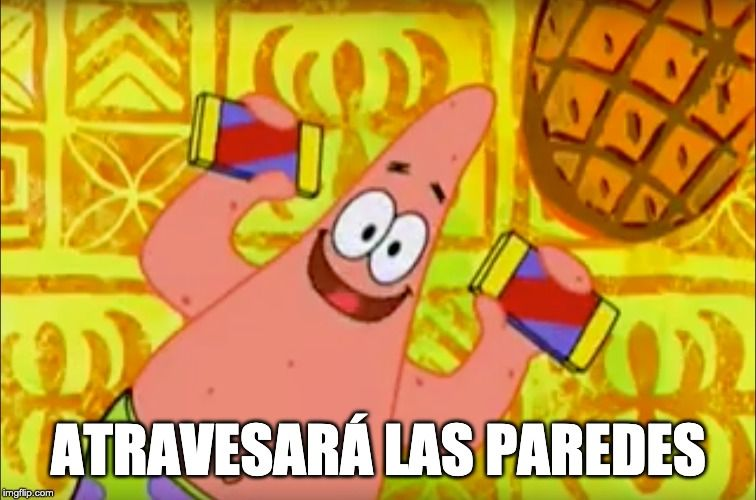

Ser programador no se limita a escribir código. Hay un conjunto de
habilidades que nos ayudan a mejorar como desarrolladores y de estas la
que más destaca es **la Comunicación**.

No pretendo presentar un curso extensivo de como comunicarse
correctamente ya que yo mismo sigo teniendo problemas con la
comunicación; sino mas bien, un conjunto de normas y técnicas que he ido
aprendiendo durante mi carrera las cuales me han ayudado a expresar
mejor mis ideas y que espero te sirvan también.

## ¿Por qué es importante la comunicación como desarrolladores?

En la televisión vendieron una idea sumamente herrada de como era un
programador. El típico **solitario en el sótano**, que no tenia que
hacer nada mas que escribir “algoritmos”, “scripts” y *“entrar al
sistema”*. Todos temían hablar con el ya que su vida de recluido lo
hacia menos amigable que el resto.

Luego te das cuenta de que las cosas no son como en la televisión, sino
que las mejores cosas se logran en equipo, que no hay un sótano sino una
habitación de luz con otras personas con las que debes hablar y
comunicarte para alcanzar las metas más rápido y mejor.

En este equipo tendrás líderes, compañeros y en ocasiones personas a las
que deberás guiar *(aunque no esperes guiar a nadie con pobres habilidades de comunicación)*.
Por esto es por lo que hay que saber dirigirse correctamente a estos grupos de personas,
donde cada cual tiene su propia forma de comunicarse y de entender.

Una comunicación clara y efectiva es la clave para un desarrollo eficaz.
Cuando una de las partes no está en la misma página que las demás el
proyecto se sale de sincronía y a medida que va pasando el tiempo se
hace mas difícil estar todos a la par dando como resultado: entregas a
media o fuera de tiempo, frustraciones, decepciones y la muerte.

Vale, la muerte no, pero para prevenir todas las anteriores veamos que
podemos hacer para comunicarnos mejor.

## ¿Cómo mejorar en la comunicación?

Sonará algo básico, pero **la mejor manera de mejorar es comunicándose**.

No esperes tener que liderar una reunión, que tu Project Manager esté
encima de ti o con las fechas de entrega a la vuelta de la esquina para
tener una oportunidad de comunicarte, de expresar si necesitas algo,
para decir como se están haciendo las cosas.

Inicia con personas de confianza. Si tienes problemas en las reuniones
explicando en qué estás trabajando, al menos una vez a la semana intenta
explicarle a tu amigo, pareja, desconocido, un [pato de
goma](https://es.wikipedia.org/wiki/M%C3%A9todo_de_depuraci%C3%B3n_del_patito_de_goma)
sobre lo que estás haciendo e intenta que entienda.

Se empático. La empatía se resume en *intentar ponerse en los zapatos
del otro de forma objetiva*. No vayas directo al punto, sino que
intentes ver como se siente la otra persona y entender su punto de vista
con respecto al tema y en base a esto dirigirnos.

**Aprende a leer el ambiente** va de la mano con la empatía, pero se
extiende a poder distinguir cuando usar cierto lenguaje, frases y temas
que podrían ser controversiales o usarse para distorsionar el mensaje.
Ten las conversaciones de frente cuando sea posible.

**Escudarse detrás de un email o un Slack solo funciona por un poco tiempo**, llega un punto en el que la comunicación debe escalar a un próximo nivel.

**Sé intencional.** No traigas muchos temas juntos, no divagues o hagas a
la otra persona perder el tiempo. Cualquiera que sea la intención déjala
clara, y ten una meta de hacia donde quieres llevar la conversación.
Este punto es sumamente importante para tomar control de la conversación
y no dejar que otras cosas nos distraigan.

## ¿Cómo practicar la comunicación?

**Usa las actividades extraoficiales para practicar** la comunicación.
Ya sea a la hora de almuerzo, en un evento donde haya otros compañeros
en los que no seas el centro de la conversación.

Pregunta todo lo que se te ocurra. **Las preguntas son buena forma de iniciar una conversación sobre cualquier cosa**. No tengas miedo de preguntar cosas que no sabes, eso demostrará en ti interés.
Al preguntar, dejas la “*parte pesada*” de la conversación a quien contesta y allí es cuando debes escuchar.

Una **parte esencial de la comunicación es escuchar**, y escuchar
activamente es la mejor forma de hacer entender a la otra persona que
estás interesado de modo que esa persona se sienta cómoda hablando
contigo.

> **Escuchar de forma activa** te ayuda a almacenar información importante que puedas usar en futuras conversaciones haciendo cada vez más fácil hablar con esa persona o sobre ese tema.

Es una forma de empezar y una vez que domines esto, puedes acercarte a
otros desarrolladores (cuando no estén atareados claro), preguntarles en
que están trabajando e intentar **escuchar activamente**lo que tengan
que decir. Inconscientemente esto irá trabajando en ti y cuando te toque
dar una presentación, entregar un reporte, o simplemente explicar en que
estás trabajando tu mente ya sabrá como reaccionar.

## ¿Cómo sé si está funcionando?

Pues dependerá mucho de qué definas como éxito. Pero si aplicas lo
anteriormente mencionado te puedo asegurar un par de cosas que notarás
que empezarán a cambiar, entre ellas están (sin orden particular):

1. Podrás retener mas información.
2. Las personas se sentirán mas cómodas hablando contigo.
3. Podrás explicar con facilidad y detalle en qué estás trabajando.
4. Te sentirás más seguro de ti.
5. Estarás en tu camino a convertirte en un gran líder.
6. Tendrás menos preguntas y más respuestas.
7. Claridad de pensamientos e ideas.
8. Podrás tener diferentes puntos de vista. Una mente más abierta

Pero en toda seriedad: servirás como puente para esas personas que aún
no dominan la comunicación efectiva, podrás ayudarlos y créeme, se
sentirá bien.

*******

Tener una buena comunicación **es una habilidad no técnica** que debe
estar en tu top de prioridades para aprender o mejorar, si es el caso,
cuanto antes. La recompensa de ser escuchado y entendido es genial.
Nuestros métodos pueden ser excelentes, pero si no podemos explicarlos o
justificarlos nadie los entenderá y esto puede suponer un atraso para
nosotros en nuestro camino a ser mejores desarrolladores.

Te recomiendo que empieces con pequeños pasos. Intenta en una situación
informal no ser el centro de la conversación, hacer una pregunta y
escuchar activamente a la respuesta, déjate llevar y verás la
diferencia.
