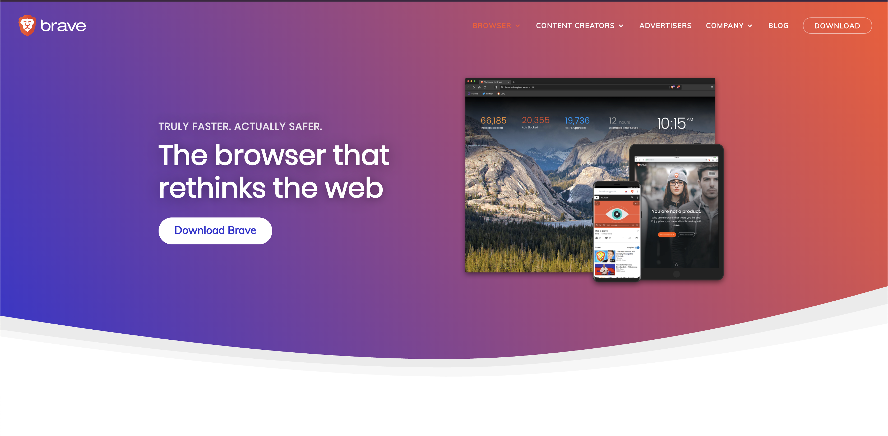

Hace ya unos meses que he estado utilizando [Brave][BraveLink] como mi navegador luego de toda una vida de Chrome.
En este post digo las razones por la que tomé esa decisión y porqué tu también deberías.
Al final menciono también algunas cosas que extraño de Chrome.

## El navegador es nuestra principal herramienta

La herramienta mas importante para un desarrollador web es el navegador. Nosotros siempre queremos trabajar
con las ultimas versiones del navegador más popular del momento; desde hace ya varios años ese navegador ha sido Google Chrome.

Aun así, debemos probar que nuestro trabajo sea accesible para todos los usuarios sin discriminar navegadores
([excepto por los que usan IE](https://www.zdnet.com/article/microsoft-makes-final-push-to-rid-world-of-internet-explorer-10/), a ese si se puede discriminar). Por esta razón tengo actualmente todos los navegadores que se me es posible tener. Chrome (normal y Canary), Firefox, Safari y el Edge Insider y he instalado y borrado algunos nuevos como Vivaldi, Opera y Blisk.

Por mucho tiempo mi navegador favorito había sido [Canary de Chrome](https://www.google.com/intl/es/chrome/canary/) desde la primera vez que lo descubrí
cuando empecé a experimentar con Flexbox.

Sin embargo, de a poco a poco fui perdiendo el amor absoluto por Google y su ideología de "privacidad" así que
fue viendo alternativas, pero ninguna parecía satisfacer mis necesidades a la hora de desarrollar sin dejar de lado lo visual.

## Un nuevo navegador en el bloque

De pronto [todos empezaron a migrar a Chromium](http://blairreeves.me/2019/08/20/the-browser-monopoly/?utm_source=taverasmisael), el proyecto de Google del que parte Chrome, que es de código abierto.
Opera fue de los primeros y todos parecieron seguir los pasos.

Ninguno me convencía hasta que apareció [Brave][BraveLink]. Este navegador, basado en Chromium prometía enfocarse principalmente
en la seguridad y privacidad del usuario, la velocidad de navegación y poder recompensar (y ser recompensado) como creador
de contenido por su propio sistema.

Lo instalé como he instalado los nuevos, para probar que traen y como funciona, que tiene de diferente y si realmente me
ayuda de alguna forma, pero realmente terminó convirtiéndose en mi navegador por defecto.

## Características por las que quedé con Brave

1. **Eficiente**: Definitivamente maneja de manera mas eficiente la memoria que Chrome. He llegado a tener mas de 60 pestañas abiertas entre 2 usuarios, sin problema.
2. **Rápido**: He notado que las páginas cargan mas rápido con este navegador. De hecho en su nueva pestaña tienen un listado de métricas y puedo confirmar que son ciertas.
3. **Tor**: Además del modo incognito tradicional, este navegador provee uno que utiliza tor para encriptar la navegación mediante VPNs, y aunque es más lento es mucho mas seguro y no hay  y mejor que instalar otro navegador.
4. **Privacidad**: Con un excelente adblocker instalado por defecto, y un maravilloso antitracker (parte de el porqué las paginas cargan más rápido), este navegador te tiene cubierto de esos sitios que no pueden dejarte en paz con sus cookies y *“cross-site tracking”*.
5. **Multiplataforma**:  De mi teléfono móvil (Android) no había podido abandonar Chrome ya que la integración con el sistema operativo y la sincronización y demás, era algo fundamental para mi. Pero Brave ofrece la misma experiencia antes descrita en móvil también y con una interfaz, en mi opinión mas agradable al usuario (con la barra de funcionalidad debajo, mas cerca de los dedos).
6. **Batería**: Esta podría ser algo subjetiva, pero la batería dura al menos 1.5x mas que con Chrome (probado en Mac, Windows y Android en situaciones similares, por eso he dicho que es un beneficio subjetivo).

## Desventajas de Brave que me hacen extrañar chrome

<Caption className="close-caption" color="text" align="center">Foto por <a rel="nofollow" target="_blank" href="https://www.pexels.com/@punttim?utm_content=attributionCopyText&utm_medium=referral&utm_source=taverasmisael">Tim Gouw</a> en Pexels</Caption>

No todo es 100% bueno, hay algunas cosas en las que [Brave][BraveLink] podría mejorar, o que hacen que Chrome parezca una mejor opción par algunos:

1. **Personalización**: Esto es algo que la comunidad [ha requerido desde siempre](https://community.brave.com/t/change-customize-blank-new-tab-page/45216). Brave carga imágenes, muy bonitas, pero genéricas en la nueva pestaña y no nos permite personalizarlas. Esto al igual que la gama de colores que solo es Brave. Aunque como dije, los temas de Chrome son compatibles, estos no modifican la pantalla de Nueva pestaña.
2. **Sincronización**: [Brave][BraveLink] para mantenerse así de seguro y rápido, dándole al usuario su privacidad, ha optado por una sincronización pasiva local en la que el usuario debe manualmente elegir que quiere sincronizar y cuando, haciéndolo con ambos dispositivos y un código, ya que a diferencia del resto Brave no guarda información del usuario, así que el no puede hacer la sincronización.
3. **Cross-site blocking**: Sí, esto puede ser algo bueno, como algo malo. Algunas aplicaciones necesitan la información entre sitios web para fines no tan malvados, como Medium por ejemplo que lo utiliza para loguear al usuario en publicaciones y dominios personalizados del usuario. [Brave][BraveLink] no hace distinción, pero nos permite desactivar para ciertos sitios esta opción desde la misma barra de navegación.
4. **Script blocking**: parecido al otro, algunos scripts son detectados por Brave como maliciosos y no nos permite utilizar ciertas aplicaciones, pero igual, podemos desactivar manual.
5. **Todo o nada**: Esto ya es algo de preferencia personal, y es que los escudos de [Brave][BraveLink] (como ellos llaman a su sistema de protección in-site) solo pueden desactivarse en conjunto; no se puede solo permitir los scripts y bloquear los anuncios. *Es Nerf o nada*.
6. **No soporta el Debugger**6. **No soporta el Debugger**: Chrome tiene esta modalidad que nos permite conectarnos de forma remota al navegador haciendo que podamos debuguear desde nuestro editor (VSCode por ejemplo), agregando breakpoints y demás en lugar de usarlas herramientas de desarrollo de google. Esto es solo posible de hacer con Google Chrome y con ningún otro proyecto de Chromium. Si alguien conoce la forma de hacerlo funcionar, por favor dígame.

## La recompensa para los creadores

Es el sistema de recompensas de [Brave][BraveLink] es otra cosa. Ya que los anuncios de los creadores son bloqueados por Brave, este permite a los creadores de contenido registrarnos en su sistema y recibir donaciones directas desde el navegador (atreves de Uphold).

Estos donativos pueden hacerse directamente con una cuenta depositando dinero real (sí, los Bitcoins ya son dinero real también) o con los [*Basic Attention Token (BAT)*](https://basicattentiontoken.org/). Estos son la propia moneda virtual con la que [Brave][BraveLink] recompensa a sus usuarios por navegar usando Brave, y luego los usuarios pueden usar estos tokens para donar a sus creadores favoritos, o acceder a contenido Premium.

-------

Si te ha gustado [Brave][BraveLink] te invito a que lo descargues y lo pruebes un tiempo, creo que te va a encantar. Yo lo empecé a usar solo para ver que tal y terminó enamorándome y ahora es el único navegador que utilizo.

Debo aclarar que, aunque Brave no me ha pagado para promocionar su navegador (ya quisiera yo), cada enlace a [Brave][BraveLink] en este post tiene mi propio código de creador asociado, así que cada descarga es una ayuda para mi y mantener este website sin anuncios molestos y buen contenido.

### Cuéntame tu [experiencia usando Brave](https://twitter.com/taverasmisael)

[BraveLink]: https://brave.com/tav072
