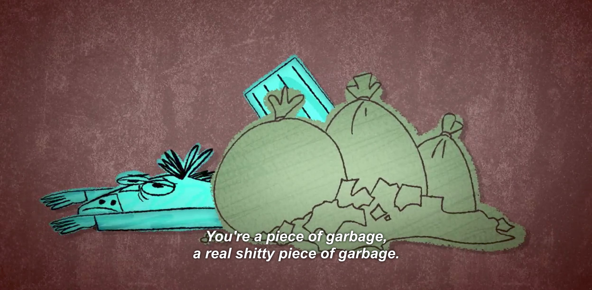
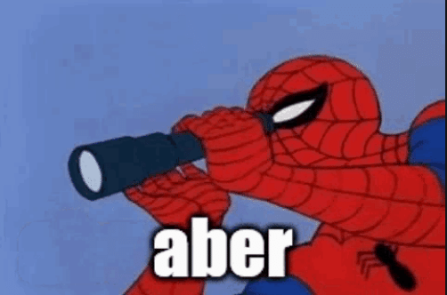
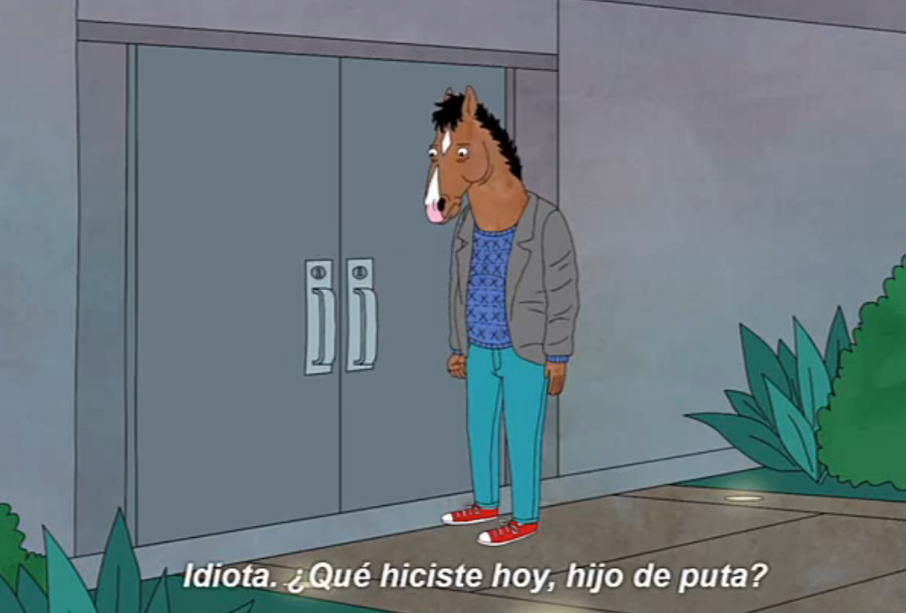

Son las 7 y como cada día suena la alarma. Es super temprano, entras a trabajar mucho màs tarde y hay tiempo, pero te propusiste que esta semana sí empezarías con tus metas. La alarma a las 7 no es para trabajar, es para correr y hacer ejercicio por unos 45 minutos, llegar a casa y leer un libro. Luego dedicar tus horas màs productivas a tus proyectos personales para luego darte un baño y ahora si trabajar.

Son las 8. *¿Como llegue a aquí?* Bueno, supongo que la respuesta es fácil, nunca me paré de la cama. Adiós hora de correr. No has dormido nada, porque tu ansiedad te mantuvo despierto hasta las 3 am viendo una pantalla. Esa hora entre dormido y despierto después que la tercera alarma se cansara de sonar solo te dio màs dolor de cabeza, pero hay que ser productivo. Te arrastras de la cama como puedes, te aseas y vas a la cocina y te dispones a hacer café y te dices:

\- *"No debería necesitar de esta droga para mantenerme despierto"*. Así que en un último intento de retomar control de tu vida no haces café como si tuvieras que probarle ~~**(a ti mismo)**~~ a alguien que aún puedes tomar decisiones y no vives de forma automática.

\- *"Solo a ver si alguien me escribió"*. Te dices antes de pasarte por todas las aplicaciones de redes sociales que tienes instaladas, esas mismas que dijiste que ibas a borrar para centrarte màs en tu crecimiento emocional. Efectivamente nadie te escribió. En parte porque no le importas a nadie y en parte porque no eres interesante. Eso debe ser.

Sigues haciendo scroll sin sentido hasta en la aplicación de Amazon para sentir que "estás haciendo algo" pero no puedes ni entender lo que lees porque tu cerebro necesita drogarse, así que igual terminas haciendo café.

\- *"¡Oh shit el café!"* Es lo único que puedes decir mientras corres a la cocina a apagar el café que hirvió mientras entrabas de Facebook, a [Twitter](https://twitter.com/taverasmisael), a Telegram,  a Reddit, a ver como el mundo sigue su curso sin ti.

> "Si es cierto que la vida es tu propia película, soy Indiana Jones en los cazadores del arca perdida".

\- *"Este café quemado sabe a mierda. Tampoco es como que yo merezca otra cosa"*. Sigues criticándote como si el estar consciente de tu situación te hiciera mejor persona.

Caminas y te sientas en tu cámara de tortura donde pasarás las próximas 16 horas del día. Sueltas el teléfono, no sin darle una nueva chequeada a los últimos **inexistentes** mensajes y notificaciones y te propones: **Ahora sí, a trabajar**.

Sin embargo, abres el navegador y te vas directo a Facebook porque en los 15 segundos que tomo soltar el cel, encender la pc y abrir el navegador es probable que alguien te haya escrito. Bueno no, nadie lo hizo, así que ahora sí puedo enfocarme en trabajar en lo que quiero.

\- *"SON LAS 10"* y tienes reunión en media hora. No vale la pena empezar nada porque perderías la concentración. Mejor a ver videos en YouTube sobre lo que **DEBERÍAS** estar haciendo y así cuando lo vayas a hacer tienes una mejor idea. Aunque [Davie504](https://www.youtube.com/watch?v=5WAhJdiVmiQ) subió un video de memes...

Faltando 5 minutos para que empiece la reunión, enciendes el ordenador corriendo y entras justo a tiempo. Esperas tu turno para hablar repitiendo en tu mente: *"A nadie le importa lo que tenga que decir".*

\- "Oh si. Hoy voy a trabajar en algo importante pero que al final no importa y ayer realmente no trabaje porque necesitaba ayuda con algo y a las 4 personas que le escribí me ignoraron igual como me van a ignorar ustedes ahora".

\- "Excelente. Si nadie tiene mas nada que decir hablamos mañana". Se despiden, tu haces una virada de ojos tan fuerte que puedes ver físicamente tus pensamientos.

\- "Ves a nadie le importa lo que digas, eso lo demuestra."

Te dan las 12, comes. Te dan las 3 y no sabes que has hecho (y en parte no te importa). Te dan las 5 y ya no tienes que trabajar, puedes hacer lo que quieras. Lo que quieres es poder pararte de la silla pero también quieres trabajar en lo tuyo y ahora es el tiempo.

### ¿Qué de todo lo que tengo pendiente hacer?

> ¿El blog, el podcast, el streaming, jugar, dibujar? ¿O debería enfocarme en la casa y limpiar, cocinar, pintar esa pared antes de que se seque la pintura que compre hace 6 meses? Bueno, en lo que te decides, vamos a ver que hay en YouTube. Un poco de cafeína no hace daño a las 6 de la tarde, más si esta acompañada de azucares y grasas saturadas de una lata de Pringles grande; que bien que descubriste que era un mito eso de compartirlas.

Dan las 8 de la noche y después de cenar ya son las 9. *"Que desperdicio de día".* Es lo único que piensas. Ya no hay tiempo de nada, así que es mejor dejarlo para mañana porque hoy ya no hay chance.

Claro, tu sabes que no te dormirás sino dentro de unas 4-5 horas pero prefieres invertir ese tiempo pensando en como sería si tuvieras **más horas, más oportunidades**. Piensas en como eres un ingrato con las personas que **Sí** te escribieron, te mandaron memes y te escucharon a pesar de no tener ni idea de lo que estabas hablando. Todavía te duele la cabeza, pero **no tomas nada porque sabes que es un castigo que mereces por tu estilo de vida, estilo de vida que debes cambiar.**

Estás jugando pero no aciertas ni uno porque por dentro te estàs autocriticando y si estuvieras solo, estarías llorando.

Eres decidido. Sabes que la autocritica sin acción no lleva a ningún lugar. Tomas pausa del juego. Lo cierras, cierras todo, y buscas el cuaderno donde anotaste todo lo que **debías** haber hecho hoy (y hace meses). Te das un baño para venir con mente nueva, y planeas el día perfecto. Creas recordatorios, alarmas, planes de estudio y de quehaceres. Le dices a tu asistente virtual que te levante con [música positiva](https://www.lifehack.org/531988/science-reveals-the-best-music-should-listen-different-time-day) para estar agradecido al empezar la mañana. Agregas notitas por todas partes y dices decido: **Yo puedo hacerlo. Esta vez será diferente.**

Te vas a dormir, seguro, decidido porque sabes que mañana...

#### Mañana harás lo mismo que hoy, pero con màs culpa acumulada y te sentirás peor
